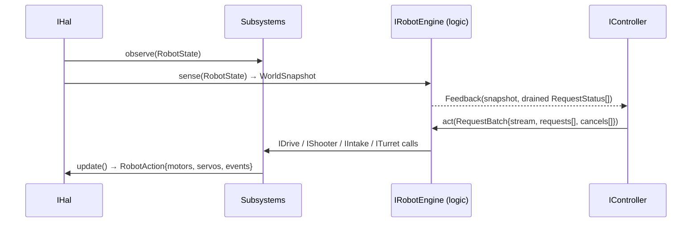
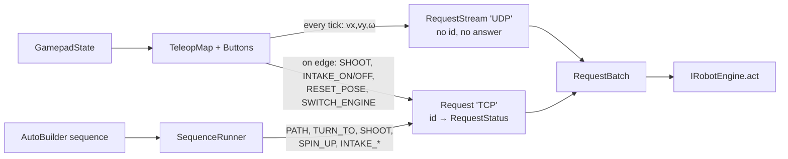
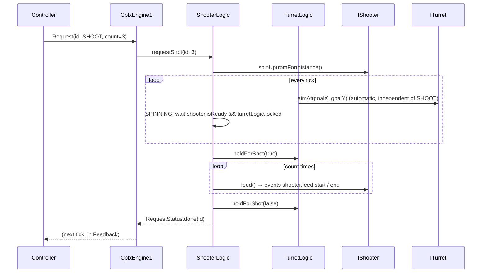
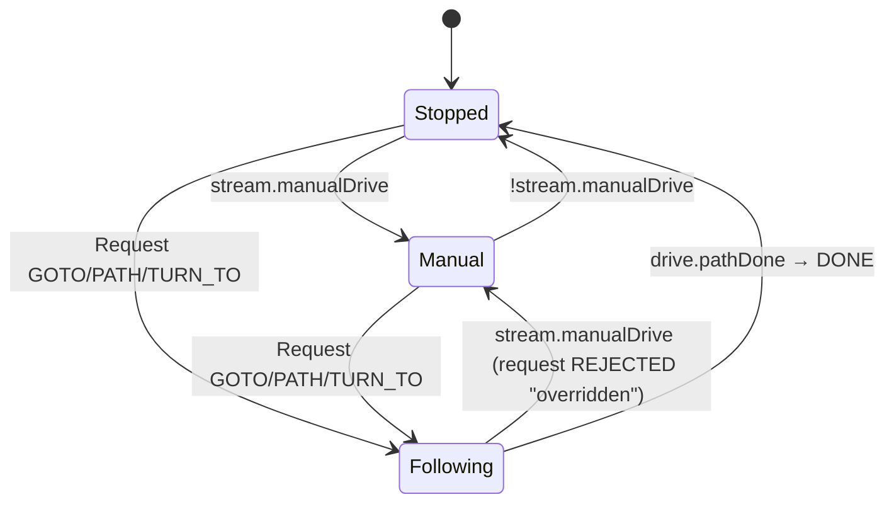
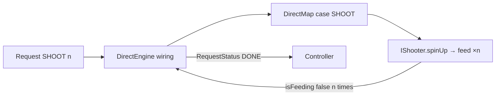
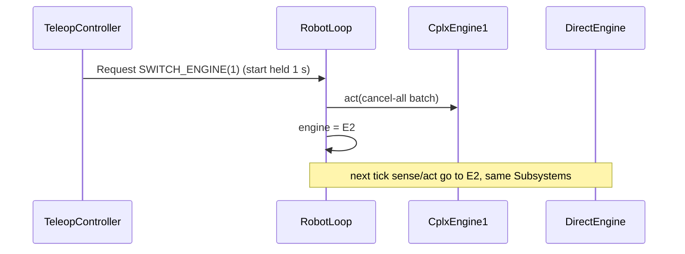

# BOOBUZZ architecture — DRAFT — R3 in progress, final pass after robot-cx-13

This is the Phase 1.1 D1 architecture draft. It describes the implementation
boundary and the R3 shape being applied in robot-code; it is not a replacement
for protokol.md (owned by ftc-main) or for the historical Turkish mimari.md.
The final pass is intentionally deferred until robot-cx-13 finishes and its
cross-review is accepted.

The code and comments are English at the observed heads. This draft uses English
class/package identifiers even when an older journey note still contains a
Turkish or pre-R3 name.

## 1. Where the code lives

### Repository and branch map

| Repository | Branch | Local path | Observed revision | Role |
|---|---|---|---|---|
| boobuzz-docs | stable | /home/shared/projects/boobuzz/docs | D1 A2 commit 9a9c9c2 while this draft is refreshed | Journey records, protocol pointer, architecture |
| boobuzz-robocode (local robot-code) | dev-phase-1.1 | /home/shared/projects/boobuzz/robot-code | committed R3.1 rename 5defadf; Request edits were in progress in the working tree | Java core, FTC/Android HAL, Java simulator client |
| boobuzz-recocknize (local re-cock-nize) | dev-phase-1.1 | /home/shared/projects/boobuzz/re-cock-nize | 8af8281 | Python physics server, viewer, simulator tests |
| boobuzz-ballautoistic (local ball-auto-istic) | project repository | /home/shared/projects/boobuzz/ball-auto-istic | not used by this seam | Separate ball/strategy work |

GitHub names were changed to the names in the first column; local folder names
were deliberately left unchanged. The older documentation shorthand
dev-phase-1 is the Phase 1 baseline. Phase 1.1 work is on dev-phase-1.1; the
old cplx_engine_1 engine string remains accepted as a one-phase alias.

### robot-code tree

```
robot-code/
├── settings.gradle
├── FtcRobotController/                       # upstream FTC SDK module
├── TeamCode/
│   ├── build.gradle                           # Android app; depends on :core
│   ├── core/                                  # Gradle project :core
│   │   ├── build.gradle                       # Java 17, SDK guard
│   │   └── src/main/java/boobuzz/core/
│   │       ├── contract/                      # DTOs and request records
│   │       ├── hal/                           # IHal, Mechanism, RobotConstants
│   │       ├── subsystem/
│   │       │   ├── pedro/                     # Pedro 3.0 bridge
│   │       │   └── stub/                      # timing-only mechanisms
│   │       ├── logic/
│   │       │   ├── direct/                    # DirectEngine (DirectMap is R3 WIP)
│   │       │   └── cplx1/                     # CplxEngine1 (logic modules R3 WIP)
│   │       ├── controller/
│   │       │   ├── teleop/                    # TeleopController (TeleopMap R3 WIP)
│   │       │   ├── auto/                      # AutoController/Builder/Sequence/Step/Runner
│   │       │   └── opmodes/                   # six routine data classes
│   │       ├── RobotLoop.java
│   │       └── RobotFactory.java
│   └── src/main/java/org/firstinspires/ftc/teamcode/
│       ├── hal/                               # Hardware and RealHal
│       └── opmode/                            # TeleOp and autonomous shells
└── sim/
    ├── build.gradle                            # Gradle project :sim
    └── src/main/java/boobuzz/sim/
        ├── SimHal.java                         # TCP L1 adapter
        ├── SimMain.java                        # command-line runner
        ├── Json.java
        └── *Exception.java
```

The tests mirror Java packages under
TeamCode/core/src/test/java/boobuzz/core/ and simulator adapter tests are under
sim/src/test/java/boobuzz/sim/.

### re-cock-nize tree

```
re-cock-nize/
├── sim/
│   ├── server.py                              # TCP protocol and lockstep
│   ├── mechanism.py                           # RobotConstants.java reader
│   ├── encoder.py                             # integer tick quantisation
│   ├── field.py                               # field dimensions and projection
│   ├── physics/
│   │   ├── backend.py                          # PhysicsBackend interface
│   │   ├── motor.py                            # shared motor/sensor model
│   │   ├── kinematic_backend.py                # Euler comparison backend
│   │   ├── pymunk_backend.py                   # Pymunk rigid body
│   │   ├── pybullet_backend.py                 # deterministic PyBullet body
│   │   └── multi.py                            # shared world for multiple bodies
│   ├── assets/field_biobuzz.png                # optional viewer background
│   └── viewer.py                               # pygame input/drawing
├── tests/                                      # backend, protocol, signal, viewer tests
├── tools/fake_client.py                       # Java-free protocol client
└── requirements.txt
```

The old sim/physics.py name is a compatibility alias in history; current
physics implementations are in sim/physics/. carryover/ remains legacy and is
not imported by the server.

### Layer to package to class table

| Layer/boundary | Package or module path | Key classes and records |
|---|---|---|
| Contract DTOs | boobuzz.core.contract | RobotState, RobotAction, Event, WorldSnapshot, Feedback, GamepadState, IGamepadSource, Request, RequestBatch, RequestStream, RequestStatus, RequestType, PathRequest |
| HAL/configuration | boobuzz.core.hal | IHal, Mechanism, RobotConstants |
| Subsystem interfaces | boobuzz.core.subsystem | ISubsystem, IDrive, IShooter, IIntake, ITurret, Subsystems |
| Pedro implementation | boobuzz.core.subsystem.pedro | PedroDrive, HalDrivetrain, HalLocalizer, PathRegistry, PedroConstants |
| Mechanism stubs | boobuzz.core.subsystem.stub | StubShooter, StubIntake, StubTurret |
| Logic engines | boobuzz.core.logic and logic/direct, logic/cplx1 | IRobotEngine, DirectEngine, planned DirectMap, CplxEngine1, planned MotionLogic, TurretLogic, ShooterLogic |
| Controllers | boobuzz.core.controller and controller/teleop, controller/auto, controller/opmodes | IController, Buttons, TeleopMap, TeleopController, AutoController, AutoBuilder, AutoSequence, AutoStep, SequenceRunner, AutoRegistry and six routine classes |
| Tick/orchestration | boobuzz.core | RobotLoop, RobotFactory |
| Real HAL and FTC shell | org.firstinspires.ftc.teamcode.hal and .opmode | Hardware, RealHal, TeleopMain, AutoMain, six *OpMode wrappers |
| Java simulator seam | boobuzz.sim in Gradle :sim | SimHal, SimMain, Json, protocol exceptions |
| Python physics seam | sim.* | SimServer, Mechanism, PhysicsBackend, MotorModel, three backends, Viewer |

RequestBatch/RequestStream and the removed Drive/Intent are in the R3 working
transition. The R3 classes after the 5defadf rename are present in the shared
working tree, but robot-cx-13 still owns their review and final commit; this
draft therefore marks their status rather than treating the work-in-progress
tree as a released contract.

## 2. Robot architecture

### Runtime layers

The source tree has five core packages, but the runtime has three directional
layers:

1. HAL (L1) owns clocks, hardware/simulator I/O, and raw sensor/action
   translation.
2. Logic (L2) includes the engine and the narrow subsystem implementations. It
   turns raw state plus controller messages into mechanism-level RobotAction
   values.
3. Controller (L3) owns policy: gamepad mapping, autonomous sequencing, and
   request creation. It returns DTOs and never reaches into a subsystem.

contract is a DTO-only seam between those layers. The root RobotLoop and
RobotFactory are composition/orchestration; FTC SDK code is confined to
TeamCode/src.

### Ownership and forbidden knowledge

| Component | Owns | Must not know |
|---|---|---|
| IHal / RealHal / SimHal | now(), read(), write(), GamepadState source, hardware/socket details | Controller policy, engine classes, subsystem jobs, Python ground truth |
| Subsystem interfaces and implementations | One mechanism's observation, command state, and action contribution; Pedro pose/follower state | Gamepad edges, request IDs, controller policy, another subsystem's internals, IHal |
| IRobotEngine and cplx/direct logic | Sensor-to-world projection, request arbitration, jobs, statuses, subsystem calls | Raw gamepad, FTC SDK, socket protocol, direct controller callbacks |
| IController implementations | Mapping and sequencing from Feedback to RequestBatch | Hardware, IHal, subsystem objects, motor names, physics |
| contract records | Immutable message shapes and validation | Any core implementation or SDK class (apart from the external Pose value used by the existing contract) |
| RobotLoop / RobotFactory | Fixed call order and dependency construction | Mechanism-specific policy; engine internals are selected, not inspected |

The dependency test enforces the same direction: contract imports no core
package; hal imports contract; subsystem imports contract and Mechanism or
RobotConstants (not IHal); logic imports contract and subsystem; controller
imports contract; only root composition wires all parts.

### One RobotLoop tick

The current R3 transition has this fixed single-threaded order:

1. RobotState state = hal.read().
2. WorldSnapshot snapshot = engine.sense(state). sense lets each subsystem
   observe the same sample.
3. Feedback feedback = new Feedback(snapshot, engine.drainStatuses(), state.t()).
   Statuses were produced by the preceding tick's act; this is deliberately one
   tick delayed.
4. RequestBatch batch = controller.decide(feedback).
5. engine.act(batch). The engine applies stream levels, cancellations, and
   edge-triggered requests to subsystem interfaces.
6. RobotAction action = engine.action(). Subsystems update in fixed
   drive, shooter, intake order (and turret after it is added).
7. hal.write(action).

hal.now() is the HAL clock; no wall-clock call orders a tick in core.
R3.7 will add RobotLoop.setEngine(IRobotEngine): a SWITCH_ENGINE(index) request
is consumed by the loop before the current engine sees the batch, the old engine
receives cancel-all, and the new engine starts on the next tick over the same
Subsystems object.

## 3. Simulator capabilities

### Shared model and selectable backends

re-cock-nize is physics and rendering only; it contains no robot logic. The
server selects one PhysicsBackend:

- kinematic: comparison baseline. It applies the shared motor model, derives
  chassis twist by least-squares mecanum inverse, Euler-integrates pose, and
  clamps the footprint to the 144-inch field.
- pymunk (default): deterministic planar rigid body in a pymunk.Space, four
  static walls, friction, traction forces at wheel positions, contacts,
  angled-wall rotation, and wall sliding.
- pybullet: deterministic planar body on a ground plane with four walls,
  force-at-wheel traction, fixed solver settings, and optional native GUI. It
  uses DIRECT in headless mode.

sim/physics/motor.py is shared by all three. It models each wheel separately:
power is clamped to [-1, 1], a calibrated free-speed target is multiplied by
wheel efficiency, and output speed follows a first-order lag with
MOTOR_TAU_S = 0.1 s. BATTERY_V is carried in the mechanism and emitted as the
state voltage; the current implementation does not model voltage sag, current
draw, or a back-EMF circuit. Kinematic wheel-rim/chassis conversion is derived
from each wheel's position and roller angle, not from handwritten front/rear
signs. Encoder integration uses motor wheel output speed, then
QuantizedEncoder emits integer ticks. Pinpoint and IMU values are noisy,
seeded samples; truth remains separate.

The pygame Viewer is optional. It polls keyboard values into the protocol
gamepad block, draws the 144-inch field, a centered 141-inch background image,
axes, alliance edges, robot trail, truth pose, encoders, events, and a panel.
--headless never imports pygame and runs without real-time pacing. Repeating a
reset seed and exactly the same step sequence is deterministic; the seeded
noise stream is part of the state sequence.

### Calibration and origin

The Python reader consumes the same
TeamCode/core/src/main/java/boobuzz/core/hal/RobotConstants.java file as Java.
The comments identify the calibration source as last season's
archive/ftc/de-cock/TeamCode/pedroPathing/Constants.java.

| Value | Current value | Origin/meaning |
|---|---:|---|
| ROBOT_WIDTH, ROBOT_LENGTH | 18.0 in, 18.0 in | current chassis footprint |
| ROBOT_MASS_KG | 12.0 kg | compile-time constant; both rigid backends currently use literal 12.0 |
| WHEEL_DIAMETER | 4.0 in | current wheel geometry |
| BATTERY_V | 12.0 V | fixed bus-voltage field; no sag model |
| MOTOR_TAU_S | 0.1 s | first-order response default |
| STRAFE_EFF | 0.7346 | last-season yVelocity/xVelocity = 54.09/73.63 |
| zero-power forward decel | 36.17 in/s² | last-season calibration magnitude |
| zero-power lateral decel | 85.98 in/s² | last-season calibration magnitude |
| wheel roller angles | +45/-45 degrees | RobotConstants motor declarations; Python converts to radians |
| wheel positions | ±6.5 forward, ±5.5 left | motor declarations, robot frame |
| wheel ticks/rev | 537.7 | motor declarations |
| wheel free RPM | 351.55735379568756 | derived from 73.63 in/s and 4 in circumference; no direct RPM measurement found |
| efficiency FL/FR/BL/BR | 1.0 each | placeholder; not measured |
| Pinpoint | (161.0, 0.0) mm; FORWARD/REVERSED; goBILDA_4_BAR_POD | last-season measured value, re-measure on new chassis |
| stub timing | spin-up 0.5 s; feed 0.2 s | Java-only mechanism stubs |

### What is and is not simulated

Simulated: motor lag and per-wheel speed, roller-angle mecanum kinematics,
strafe efficiency, directional zero-power deceleration, integer encoder ticks,
noisy Pinpoint/IMU, the planar chassis and wall contacts (Pymunk/PyBullet),
optional gamepad input, event logging, and deterministic replay.

Not simulated: shooter, intake, turret, balls, goals, field elements, vision,
battery sag/current/thermal behavior, servo motion, or a hardware Pinpoint
device. Java StubShooter and StubIntake only time commands and emit events; their
state is not a force or a ball trajectory. truth is available to the viewer and
:sim tests only and is never copied into RobotState or logic.

## 4. Logic engines

### cplx_engine_N convention

Each complex engine is a sibling under boobuzz.core.logic (cplx1, future cplx2,
and so on). An engine owns its own logic modules; engines do not share
implementation code. Shared contracts and subsystem interfaces are the only
intended reuse. During this transition RobotFactory accepts both cplx1 and the
historical cplx_engine_1 string; canonical name is cplx1.

### cplx1 contents and status

The R3 target tree is:

```
logic/
├── IRobotEngine.java
├── direct/
│   ├── DirectEngine.java
│   └── DirectMap.java
└── cplx1/
    ├── CplxEngine1.java
    ├── MotionLogic.java
    ├── TurretLogic.java
    └── ShooterLogic.java
```

At the committed R3.1 rename, CplxEngine1 is present and its Pedro-backed
Subsystems are present; MotionLogic, TurretLogic, ShooterLogic and DirectMap
are R3 work in progress. The current transition implementation composes
CplxEngine1 with DirectEngine, so request dispatch is intentionally simple until
the three modules land.

Pedro bridging is in subsystem/pedro, not in the engine package:

- PedroDrive implements IDrive, feeds HalLocalizer from Pinpoint, runs the Pedro
  Follower, and writes wheel powers through HalDrivetrain.
- HalDrivetrain implements Pedro's drivetrain seam and converts DrivePowers to
  named motor powers, with finite/clamped output protection.
- HalLocalizer implements Pedro Localizer; it applies a software pose offset and
  computes velocity from successive HAL samples.
- PathRegistry holds named test-line from (72,72,0) to (120,72,0) and test-turn
  hold target at (120,72,π/2).
- PedroConstants constructs the Pedro follower with the shared mechanism.

The behaviours exposed by the R3 contract are:

| Behaviour name | Current R3 representation |
|---|---|
| Manual | RequestStream.manual(vx, vy, omega) level for the current tick |
| Velocity | Same stream carries robot-frame velocity levels; no separate Drive.Velocity record |
| GoTo | RequestType.GOTO with x/y/heading parameters or a PathRequest target |
| FollowPath | RequestType.PATH carrying a named PathRequest or ordered segments |
| Hold | No active drive request means IDrive.stop(); a path may also set holdEnd |

MotionLogic will own stream/request arbitration: manual stream wins and rejects
an active drive request; a tick with neither manual stream nor drive request stops
the drive. TurretLogic will aim at the configured goal every tick (or scan when
pose is unavailable) and expose a lock state. ShooterLogic will implement
IDLE → SPINNING → FEEDING × count → DONE, coordinating turret hold and shooter
readiness. These module names and the call graph are the R3 design, not claims
that the uncommitted classes have already been reviewed.

### Subsystem pattern and extension recipe

ISubsystem is deliberately small:

```
interface ISubsystem {
    void observe(RobotState state);
    void update(RobotAction.Builder out);
}
```

IDrive, IShooter, and IIntake extend it. Subsystems is a fixed-order record
(IDrive drive, IShooter shooter, IIntake intake) with observe(state) and
update(); its R3 form adds ITurret. Stubs are timing-only and individually
unit-tested.

To add a subsystem:

1. Add its narrow I... extends ISubsystem interface under
   boobuzz.core.subsystem.
2. Add a testable implementation under subsystem/stub (and a real
   implementation when hardware is ready).
3. Add the field and fixed-order observe/update call to Subsystems, then
   construct it in RobotFactory.
4. Add the engine mapping in DirectMap (or the owning cplx1 logic module) and
   a unit test; do not make the controller call the subsystem directly.

To add a request type, add the enum value, add one DirectMap switch case and its
completion rule, then add controller/tests. DirectMap is intentionally the one
small, editable type-dispatch file.

## 5. Inter-module communication (the critical seam)

### Java contract records and methods

The following signatures are the source-level shapes at the R3 transition.

IHal extends IGamepadSource:

```
interface IHal extends IGamepadSource {
    long now();                         // milliseconds, HAL/simulation clock
    RobotState read();                  // one raw sample
    void write(RobotAction action);     // one motor/servo/event output
}
```

IGamepadSource is GamepadState get(). RealHal fills it from FTC gamepad1;
SimHal fills it from the server gamepad object.

```
record RobotState(long t,
                  Map<String,Integer> enc,
                  Map<String,Double> vel,
                  double yaw,
                  Pose pinpoint,
                  double voltage) {}
record WorldSnapshot(long t, Pose pose, double yaw, double voltage) {}
record Feedback(WorldSnapshot world,
                List<RequestStatus> statuses,
                long t) {}
record Event(String name, long tMs, Map<String,Double> data) {}
record RobotAction(Map<String,Double> motors,
                   Map<String,Double> servos,
                   List<Event> events) {}
```

RobotState.t is milliseconds; encoder values are integer ticks; vel is
ticks/second; yaw and pinpoint.heading are radians; Pinpoint x/y are inches;
voltage is volts. RobotState never contains simulator truth. RobotAction values
are named motor powers in [-1,1], named servo positions [0,1], and optional
timestamped events. A missing motor/servo key is treated as zero by SimHal and
RealHal.

IRobotEngine is bidirectional:

```
interface IRobotEngine {
    String name();
    WorldSnapshot sense(RobotState state);
    void act(RequestBatch batch);
    RobotAction action();
    List<RequestStatus> drainStatuses();
}
interface IController {
    RequestBatch decide(Feedback feedback);
}
```

The default action() and drainStatuses() implementations return zero/empty
values for simple test engines. The compatibility overload
sense(long now, RobotState state) is retained during migration.

#### Request, stream, batch, and status

Request is an immutable edge-triggered message:

```
record Request(int id, RequestType type, double[] params, PathRequest path) {}
enum RequestType {
    SHOOT, INTAKE, GOTO, PATH, SPIN_UP, INTAKE_ON, INTAKE_OFF, TURN_TO
}
record RequestStatus(int id, State state, double progress, String note) {
    enum State { ACCEPTED, ACTIVE, DONE, FAILED, REJECTED }
}
```

Request validates that only PATH carries a non-null PathRequest; params are a
defensive copy. The enum above is the committed transition shape. R3 adds
RESET_POSE, SWITCH_ENGINE, and test-only TURRET_AIM when their owners land.
A drive request has an id and is answered with RequestStatus; status arrives in
Feedback on the next tick.

RequestStream is the per-tick level message. It has no id and no completion
answer:

```
record RequestStream(double vx, double vy, double omega, boolean manualDrive) {}
record RequestBatch(RequestStream stream,
                    List<Request> requests,
                    int[] cancels) {}
```

vx, vy, and omega are robot-frame forward, left, and counter-clockwise levels.
manualDrive=false means no manual input this tick; an absent stream is the
zero/idle stream. RequestBatch is the complete controller output for one tick:
stream plus edge requests plus request IDs to cancel. A manual stream
cancels/rejects active GOTO, PATH, or TURN_TO work with note
overridden by manual drive; no stream and no drive request stops the drive.

The pre-R3 contract/Intent record and sealed contract/Drive variants are removed
by R3. Their behaviour maps as follows:

| Historical variant | R3 message |
|---|---|
| Drive.Manual(vx,vy,omega) | RequestStream with manualDrive=true |
| Drive.Velocity(...) | same stream (no second velocity DTO) |
| Drive.GoTo(target,constraints) | Request(GOTO, ...) / PathRequest.goTo |
| Drive.FollowPath(pathId) | Request(PATH, PathRequest.named(pathId)) |
| Drive.Hold | no active request; drive stop/hold is the absence rule |

#### PathRequest payload

PathRequest is the immutable path value used by PATH and autonomous builders:

```
record PathRequest(String pathId,
                   Pose target,
                   Constraints constraints,
                   List<Segment> segments,
                   Heading heading,
                   boolean holdEnd,
                   Double velocityConstraint,
                   Braking braking) {}
record Constraints(double maxPower, double maxVelocity) {}
enum HeadingMode { TANGENT, TANGENT_REVERSE, CONSTANT, LINEAR }
record Heading(HeadingMode mode, double start, double end) {}
record Braking(double strength, double startMultiplier) {}
sealed interface Segment { Pose end(); }
record Line(Pose end) implements Segment {}
record Curve(Pose end, List<Pose> controlPoints) implements Segment {}
```

A named request uses pathId; a direct target uses target; an inline path uses
ordered Line/Curve segments. Headings and braking/velocity modifiers are carried
in the request, in field inches/radians and Pedro constraints' native units.

#### Mechanism and compile-time configuration

There is no current MechanismLoader and no mechanism.yaml. The old YAML schema
is closed: configuration errors must fail at Java compile time, and removing a
runtime parser leaves fewer moving parts. Mechanism is the immutable runtime
value built by RobotConstants.DEFAULT:

```
record Mechanism(List<String> motorNames,
                 List<String> servoNames,
                 Map<String,Motor> motors,
                 Drivetrain drivetrain,
                 Pinpoint pinpoint,
                 Physics physics) {}
record Motor(String drives, double forward, double left, double freeRpm) {}
record Drivetrain(double wheelDiameter) {}
record Pinpoint(double xPodOffsetMm, double yPodOffsetMm,
                String xPodDirection, String yPodDirection, String podType) {}
record Physics(Map<String,Double> efficiency,
               double strafeEfficiency,
               double zeroPowerDecelForwardInchesPerSecondSquared,
               double zeroPowerDecelLateralInchesPerSecondSquared) {}
```

RobotConstants.java is the shared source. The Python sim/mechanism.py reader
depends on these one-line forms (do not wrap a declaration or change the
argument order):

```
public static final double NAME = value;
public static final String NAME = "value";
public static final Motor FL = new Motor("fl", "wheel", xForward, yLeft, rollerDeg, ticksPerRev, freeRpm);
public static final String[] SERVOS = {};
public static final Pinpoint PINPOINT = new Pinpoint(xOffsetMm, yOffsetMm, xDirection, yDirection, podType);
```

The actual motor declarations are one physical line in the Java file; the
wrapped form above shows the grammar only. Scalar names currently read by the
Python regex include ROBOT_WIDTH, ROBOT_LENGTH, ROBOT_MASS_KG, WHEEL_DIAMETER,
BATTERY_V, MOTOR_TAU_S, EFFICIENCY_FL/FR/BL/BR, STRAFE_EFF,
ZERO_POWER_DECEL_FORWARD_IN_S2, and ZERO_POWER_DECEL_LATERAL_IN_S2. String names
are ANGLE_UNIT and DRIVETRAIN_TYPE. Each motor has exactly seven arguments:
name, drives, xForward, yLeft, rollerDeg, ticksPerRev, and freeRpm; Python
converts roller degrees to radians. MOTORS defines protocol motor order and
SERVOS defines servo names. Pinpoint carries offsets, directions, and pod type.
Java validates the server ready name lists before a run continues.

#### Subsystems and events

Subsystems.observe(state) calls each subsystem once; Subsystems.update() calls
each in fixed order into one RobotAction.Builder. RealHal ignores events for
hardware, while SimHal serializes them. Current stub event names are
shooter.feed.start, shooter.feed.end, intake.on, and intake.off. The R3 turret
stub adds turret.locked and turret.scan. Event payloads are not interpreted by
physics.

### Simulator JSON protocol

The wire transport is TCP on 127.0.0.1:5555, UTF-8, one JSON object per line.
Python is the server and Java :sim is the client/clock owner. Protocol version
is 1.

#### reset to ready

Java sends:

```
{"type":"reset","seed":0,"pose":{"x":0.0,"y":0.0,"h":0.0}}
```

seed is an integer RNG seed. Pose x/y are field inches and h is field heading
in radians. Python resets the selected backend, clears event/state logs, and
returns:

```
{
  "type":"ready",
  "motors":["fl","fr","bl","br"],
  "servos":[],
  "proto":1,
  "state":{
    "t_ms":0,
    "enc":{"fl":0,"fr":0,"bl":0,"br":0},
    "vel":{"fl":0.0,"fr":0.0,"bl":0.0,"br":0.0},
    "imu":{"yaw":0.0},
    "pinpoint":{"x":0.0,"y":0.0,"h":0.0},
    "voltage":12.0,
    "gamepad":{"lx":0.0,"ly":0.0,"rx":0.0,"ry":0.0,
      "a":false,"b":false,"x":false,"y":false,
      "lb":false,"rb":false,"lt":0.0,"rt":0.0,"dpad":"none"},
    "truth":{"x":0.0,"y":0.0,"h":0.0}
  }
}
```

ready.state is the initial state at t_ms=0; the first Java RobotLoop.tick()
can call read() before physics time advances. dt_ms=0 is invalid for a normal
step, but reset itself has no dt_ms.

#### step and state

For every tick Java sends exactly one step:

```
{
  "type":"step",
  "dt_ms":20,
  "motors":{"fl":0.5,"fr":-0.3,"bl":0.5,"br":-0.3},
  "servos":{},
  "events":[
    {"name":"shooter.feed.start","t_ms":1240,"data":{}}
  ]
}
```

dt_ms is a positive integer number of milliseconds and is the simulation time
advanced by exactly this one step. Motor values are powers in [-1,1]; missing
motor keys are zero. Servo values are positions in [0,1] and are transported
for the HAL seam but have no physics model. events is optional and must be an
array; each event has a non-empty string name, numeric finite t_ms (legacy key
t is accepted), and an object data. The server records events in its state/event
logs and viewer; it does not derive physics from them.

Python replies with a state object:

```
{
  "type":"state",
  "t_ms":1240,
  "enc":{"fl":1203,"fr":-870,"bl":1199,"br":-865},
  "vel":{"fl":2400.0,"fr":-1700.0,"bl":2400.0,"br":-1700.0},
  "imu":{"yaw":0.12},
  "pinpoint":{"x":3.1,"y":0.4,"h":0.12},
  "voltage":12.0,
  "gamepad":{"lx":0.0,"ly":-0.8,"rx":0.0,"ry":0.0,
    "a":false,"b":false,"x":false,"y":false,
    "lb":false,"rb":false,"lt":0.0,"rt":0.0,"dpad":"none"},
  "truth":{"x":3.0,"y":0.5,"h":0.12}
}
```

enc is integer motor ticks; vel is ticks/second; x/y lengths are inches; all
headings are radians; voltage is volts. Gamepad sticks are [-1,1], triggers
are [0,1], buttons are booleans, and dpad is one of none/up/down/left/right.
truth is deliberately not a RobotState field: only SimHal.truth() and the
viewer may read it. The server does not advance physics until step arrives, and
SimHal.write() blocks waiting for the matching state.

#### bye

Java sends {"type":"bye"} when the client closes. The server closes that
connection and waits for another client; there is no reply. Unknown message
types, malformed JSON, invalid dt_ms, or malformed event arrays terminate the
connection with a protocol error.

### Allowed communication and shared state

| Sender | Receiver | Allowed values |
|---|---|---|
| HAL | subsystem/engine | RobotState through read; the engine calls sense |
| HAL | controller | GamepadState through IGamepadSource only |
| Controller | engine | Feedback in; RequestBatch out |
| Engine | subsystem | narrow method calls (manual, follow, spinUp, feed, and so on) |
| Subsystem | engine | WorldSnapshot contribution and RobotAction.Builder contribution |
| Engine | HAL | completed RobotAction via RobotLoop |
| SimHal | Python server | JSON reset/step/bye |
| Python server | SimHal | JSON ready/state; truth is quarantined |

No controller may call a subsystem or write a motor. No subsystem may call a
controller or inspect a request stream. No logic class may open the socket or
read truth. The Python server never imports Java logic.

Shared mutable state is intentionally minimal: immutable static RobotConstants,
the immutable Mechanism.DEFAULT graph, per-loop tick count, per-engine request
jobs/status queue, per-subsystem private observation/action state, and Python
backend pose/RNG/logs. There is no singleton engine, global request queue, or
shared truth pose. An engine switch transfers the same subsystem object between
engines; it does not introduce a global bus.

### Tick sequence: simulator and real robot

The six design diagrams below use the same RobotLoop order. In a simulator,
SimHal.read() returns the last state from the socket and SimHal.write() sends
step and waits for the next state; on hardware, RealHal.read() samples
Pinpoint/IMU/motors and RealHal.write() writes FTC devices. All upper-layer calls
are identical.

The HAL substitution is the only simulator/robot branch; there is no isSim
branch in core.

### Six R3 request-flow diagrams

The following six diagrams are copied from
phases/phase-1.1/request-flow.md; that file remains the diagram source of truth.

#### 1. One tick



#### 2. Two message kinds



#### 3. SHOOT in cplx1



#### 4. Drive arbitration



#### 5. SHOOT in direct



#### 6. Engine switch



## 6. Build and run

### Gradle modules and SDK guard

robot-code/settings.gradle includes :FtcRobotController, :TeamCode, :core,
and :sim; project(':core').projectDir = file('TeamCode/core'). :core and
:sim target Java 17. :core is a Java library with the pure-Java Pedro 3.0
core artifact; :sim depends on :core and never on :TeamCode. Android :TeamCode
owns RealHal, Hardware, and OpModes.

gradle/sdk-guard.gradle runs before compileJava in :core and :sim. It fails the
build if source/test files in either pure-Java module mention com.qualcomm,
org.firstinspires, or android. This is a build error, not a review convention.

Use Java 21 for the Gradle wrapper (the modules target Java 17):

```
export JAVA_HOME=/usr/lib/jvm/java-21-openjdk
./gradlew :core:test :sim:test
./gradlew :TeamCode:assembleDebug
```

### Python simulator tests and server

```
cd /home/shared/projects/boobuzz/re-cock-nize
python -m venv .venv
.venv/bin/pip install -r requirements.txt
PYTHON="$PWD/.venv/bin/python" ./run_tests.sh
.venv/bin/python -m sim.server \
  --mechanism /home/shared/projects/boobuzz/robot-code/TeamCode/core/src/main/java/boobuzz/core/hal/RobotConstants.java \
  --physics pymunk --headless --port 5556
```

Use --physics kinematic for comparison, --physics pybullet --headless for
deterministic Bullet, or --physics pybullet --gui for the native Bullet window.
Omitting --headless selects the pygame viewer for Pymunk/kinematic. Do not
install npm tooling for this documentation pipeline.

### Java simulator and end-to-end

Start the Python server first, then run the Java client:

```
cd /home/shared/projects/boobuzz/robot-code
export JAVA_HOME=/usr/lib/jvm/java-21-openjdk
./gradlew :sim:run --args="--port 5556 --path test-line --x 72 --y 72 --h 0 --dt 20 --steps 1000 --seed 1"
```

SimMain also accepts --engine direct|cplx1 (and temporary cplx_engine_1 alias),
--drive vx,vy,omega, and --auto <AutoRegistry name>. Physics is selected on the
Python server, not in Java. Registry names are BlueDoggy6Piece,
RedDoggy6Piece, BlueMissionary9Piece, RedMissionary9Piece,
BlueMissionary9PieceLever, and RedMissionary9PieceLever.

## Appendix A — Per-class reference

| Class/file | Short reference |
|---|---|
| IHal | HAL clock/read/write and gamepad seam |
| RealHal | FTC HardwareMap, Pinpoint, motors, servos, voltage, gamepad1 adapter |
| SimHal | TCP client; reset handshake; one step/state exchange; truth quarantine |
| RobotState | Raw sensor DTO |
| WorldSnapshot | Logic-facing pose/yaw/voltage view |
| RobotAction / Event | Named outputs and timestamped subsystem events |
| Mechanism / RobotConstants | Immutable runtime config and compile-time source |
| ISubsystem / Subsystems | Observe/update lifecycle and fixed ordering |
| PedroDrive | Pedro follower, path requests, manual powers |
| HalDrivetrain | Pedro DrivePowers to named, finite motor powers |
| HalLocalizer | Pinpoint sample bridge and software pose offset |
| PathRegistry / PedroConstants | Named test paths and follower construction |
| StubShooter / StubIntake | Timing/state stubs with events |
| IRobotEngine | Sense/act/action/status engine seam |
| DirectEngine | Request jobs, stream arbitration, cancellation, direct wiring |
| DirectMap | R3 editable request-to-subsystem switch (pending) |
| CplxEngine1 | Complex-engine shell; currently delegates to direct dispatch |
| MotionLogic / TurretLogic / ShooterLogic | R3 drive, aim, and shot modules (pending at draft snapshot) |
| IController | Feedback to RequestBatch policy seam |
| TeleopController | Gamepad source and field-oriented drive mapping |
| Buttons / TeleopMap | R3 edge/toggle helper and editable control map (pending) |
| AutoController | Advances AutoSequence from statuses/time |
| AutoBuilder / AutoSequence / AutoStep | Fluent autonomous data and cursor |
| AutoRegistry and six routine classes | Names and builders for last season's autos |
| RobotLoop / RobotFactory | Fixed tick and engine/subsystem composition |
| SimServer | Python TCP protocol, lockstep, event/state logs |
| Mechanism reader | Regexes RobotConstants.java; converts degrees to radians |
| PhysicsBackend | Reset/step/state backend seam |
| MotorModel / QuantizedEncoder | Shared lag, kinematics, noise, tick quantisation |
| KinematicBackend | Euler/clamp comparison |
| PymunkBackend / PyBulletBackend | Rigid-body/contact backends |
| Viewer | Optional pygame controls and field rendering |

## Appendix B — Open decisions and closed decisions

- R3 contract freeze: wait for robot-cx-13 implementation, tests, and Codex
  cross-review before removing the DRAFT marker.
- Pinpoint offsets: historical documents contain 161/0 and -84/-168
  alternatives. RobotConstants.PINPOINT is currently 161.0/0.0; hardware
  re-measurement must choose final offsets.
- Nested Android Studio module sync: :core physically lives under TeamCode/core;
  IDE indexing/sync behaviour still needs clean Android Studio verification.
- R3 engine switch ownership: SWITCH_ENGINE belongs to RobotLoop, not an engine;
  exact index validation and cancel-all status policy remain to be reviewed.
- RobotConstants record duplication: RobotConstants.Motor/Pinpoint and
  Mechanism.Motor/Pinpoint currently duplicate data shapes. Fold them into one
  representation in the next cleanup.
- Mass source: ROBOT_MASS_KG exists in Java, while both rigid backends still use
  literal 12.0; make the backends read the constant through Mechanism in cleanup.
- YAML decision — closed: mechanism.yaml, SnakeYAML, and MechanismLoader were
  removed. Compile-time failures and fewer moving parts are the rationale.
- No physical turret/shooter yet: stub-to-hardware interfaces stay narrow until
  real mechanisms exist.

## Appendix C — Contradictions to resolve (not silently merged)

These are source discrepancies observed while preparing the draft; this document
does not choose a winner:

1. The v1 portion of phases/phase-1.1/design-spec.md names Hal, Drive, Intent,
   and the old controller/autos tree; its appended R3 revision names IHal,
   RequestBatch, cplx1, and controller/opmodes.
2. robot-cx-13-r3-naming-logic-requests.md is written against pre-R3 2573880,
   while the observed branch has committed R3.1 rename 5defadf plus uncommitted
   RequestBatch/RequestStream edits. DirectMap, ITurret, StubTurret, and the
   cplx1 logic modules are not in the committed tree at this draft snapshot.
3. Older README, architecture, and Phase 1 task notes still use mechanism.yaml,
   MechanismLoader, or --mechanism mechanism.yaml; current robot/simulator code
   reads RobotConstants.java.
4. Older architecture text says the simulator is kinematic and PyBullet is not
   simulated; current re-cock-nize has Pymunk and PyBullet backends plus the
   kinematic comparison backend.
5. protokol.md historical examples use GamepadSource, Hal, and a possible 12.6 V
   state, while current names are IGamepadSource, IHal, and
   RobotConstants.BATTERY_V = 12.0.
6. The old Drive.Manual wording and current R3 RequestStream wording describe
   the same robot-frame values but different DTO names; R3 removal is still
   under review.
7. mimari.md is an intentionally stale Turkish historical inventory and
   references legacy Python modules; it is not a second current architecture
   source.
