# BOOBUZZ architecture — diagram-first

This document describes the checked-out `dev-phase-1.1` implementation.  The
requested R3 anchors are robot-code `d4226eb` and re-cock-nize `76db5f4`; the
current `dev-phase-1.1` heads used for this refresh are robot-code `907c31a`
and re-cock-nize `518bf9c`.  Source diagrams remain fenced here; `architecture/build.sh`
renders them to `architecture/diagrams/` before Pandoc creates the PDF.

## 1. Repositories and boundaries

### Repository and branch map

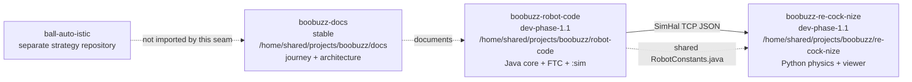
```mermaid
flowchart LR
    D["boobuzz-docs<br/>stable<br/>/home/shared/projects/boobuzz/docs<br/>journey + architecture"]
    R["boobuzz-robot-code<br/>dev-phase-1.1<br/>/home/shared/projects/boobuzz/robot-code<br/>Java core + FTC + :sim"]
    P["boobuzz-re-cock-nize<br/>dev-phase-1.1<br/>/home/shared/projects/boobuzz/re-cock-nize<br/>Python physics + viewer"]
    B["ball-auto-istic<br/>separate strategy repository"]
    D -.->|documents| R
    R -->|SimHal TCP JSON| P
    R -.->|shared RobotConstants.java| P
    B -.->|not imported by this seam| D
```

Docs is the record, not a runtime dependency.  Java `:core` is shared by the
FTC app and Java simulator; Python has no Java-logic import.  The old
`dev-phase-1` name is historical; the active work is `dev-phase-1.1`.

### `:core` allowed-import graph

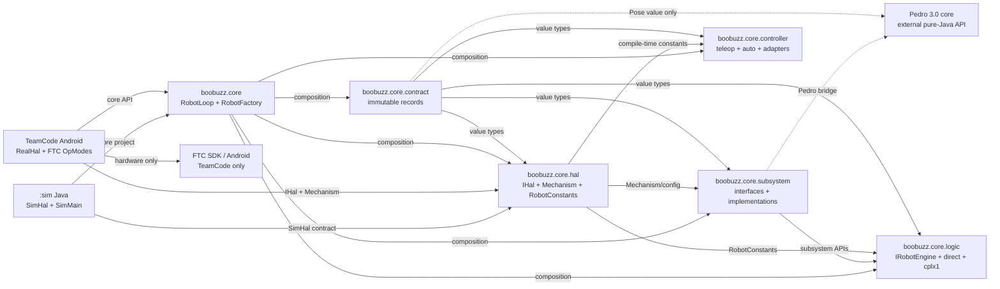
```mermaid
flowchart LR
    C["boobuzz.core.contract<br/>immutable records"]
    H["boobuzz.core.hal<br/>IHal + Mechanism + RobotConstants"]
    S["boobuzz.core.subsystem<br/>interfaces + implementations"]
    L["boobuzz.core.logic<br/>IRobotEngine + direct + cplx1"]
    K["boobuzz.core.controller<br/>teleop + auto + adapters"]
    O["boobuzz.core<br/>RobotLoop + RobotFactory"]
    T["TeamCode Android<br/>RealHal + FTC OpModes"]
    J[":sim Java<br/>SimHal + SimMain"]
    X["Pedro 3.0 core<br/>external pure-Java API"]
    Y["FTC SDK / Android<br/>TeamCode only"]
    C -->|value types| H
    C -->|value types| S
    C -->|value types| L
    C -->|value types| K
    H -->|Mechanism/config| S
    H -->|RobotConstants| L
    H -->|compile-time constants| K
    S -->|subsystem APIs| L
    O -->|composition| C
    O -->|composition| H
    O -->|composition| S
    O -->|composition| L
    O -->|composition| K
    T -->|core API| O
    T -->|IHal + Mechanism| H
    T -->|hardware only| Y
    J -->|core project| O
    J -->|SimHal contract| H
    C -.->|Pose value only| X
    S -.->|Pedro bridge| X
```

Solid arrows are imports or composition; the dotted arrows are the external
Pedro boundary.  `:core` and `:sim` contain no FTC/Android reference (the SDK
guard makes a violation a build error).  `DirectMap` calls only the static
`cplx1.ShooterLogic.calibratedRpm` helper; no engine state is shared.

### Source tree and class locations

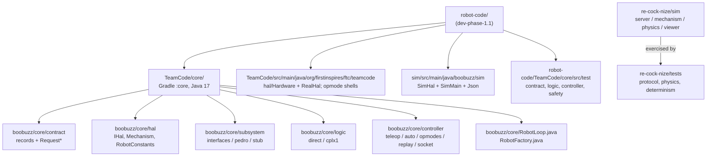
```mermaid
flowchart TB
    RC["robot-code/<br/>(dev-phase-1.1)"]
    CORE["TeamCode/core/<br/>Gradle :core, Java 17"]
    C1["boobuzz/core/contract<br/>records + Request*"]
    C2["boobuzz/core/hal<br/>IHal, Mechanism, RobotConstants"]
    C3["boobuzz/core/subsystem<br/>interfaces / pedro / stub"]
    C4["boobuzz/core/logic<br/>direct / cplx1"]
    C5["boobuzz/core/controller<br/>teleop / auto / opmodes / replay / socket"]
    ROOT["boobuzz/core/RobotLoop.java<br/>RobotFactory.java"]
    FTC["TeamCode/src/main/java/org/firstinspires/ftc/teamcode<br/>hal/Hardware + RealHal; opmode shells"]
    JSIM["sim/src/main/java/boobuzz/sim<br/>SimHal + SimMain + Json"]
    PY["re-cock-nize/sim<br/>server / mechanism / physics / viewer"]
    TEST["re-cock-nize/tests<br/>protocol, physics, determinism"]
    RTEST["robot-code/TeamCode/core/src/test<br/>contract, logic, controller, safety"]
    RC --> CORE
    CORE --> C1
    CORE --> C2
    CORE --> C3
    CORE --> C4
    CORE --> C5
    CORE --> ROOT
    RC --> FTC
    RC --> JSIM
    RC --> RTEST
    PY -->|exercised by| TEST
```

| Layer | Package/module path (tree above) | Key classes |
|---|---|---|
| Contract | `core.contract` | `RobotState`; `Request`; `PathRequest` |
| HAL/config | `core.hal` | `IHal`, `Mechanism`, `RobotConstants` |
| Subsystems | `core.subsystem` | `IDrive`; `IShooter`; `ITurret` |
| Pedro bridge | `core.subsystem.pedro` | `PedroDrive`; `HalLocalizer` |
| Stubs | `core.subsystem.stub` | `StubShooter`; `StubIntake` |
| Engines | `core.logic.direct` / `.cplx1` | `DirectEngine`; `CplxEngine1` |
| Controllers | `core.controller.{teleop,auto,opmodes,replay,socket}` | `TeleopController`; `AutoController` |
| Orchestration | `core` | `RobotLoop`, `RobotFactory` |
| FTC shell | `teamcode.{hal,opmode}` (full package in tree) | `Hardware`; `RealHal`; `*OpMode` |
| Java sim | `boobuzz.sim` (`:sim`) | `SimHal`, `SimMain`, `Json` |
| Python sim/tests | `sim` / `tests` (re-cock-nize) | `SimServer`; `PhysicsBackend`; `Viewer` |

## 2. Runtime layers

### RobotLoop tick sequence

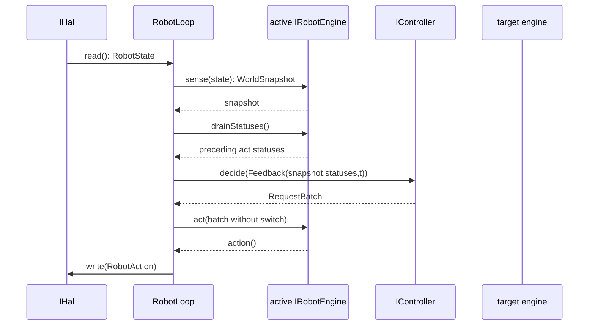
```mermaid
sequenceDiagram
    participant H as IHal
    participant L as RobotLoop
    participant E as active IRobotEngine
    participant C as IController
    participant N as target engine
    H->>L: read(): RobotState
    L->>E: sense(state): WorldSnapshot
    E-->>L: snapshot
    L->>E: drainStatuses()
    E-->>L: preceding act statuses
    L->>C: decide(Feedback(snapshot,statuses,t))
    C-->>L: RequestBatch
    L->>E: act(batch without switch)
    E-->>L: action()
    L->>H: write(RobotAction)
```

One thread owns the fixed order: read, sense, feedback, decide, optional
handoff, act, action, write.  Statuses are deliberately one tick delayed;
`RobotLoop` never calls the controller from an engine.

- **HAL** owns the clock, raw sensors, device/socket I/O, and gamepad source;
  it must not know policy, request jobs, engine internals, or simulator truth.
- **Logic + subsystems** own world projection, arbitration, mechanism state, and
  statuses; they must not know FTC SDK, gamepad edges, controller callbacks, or wire JSON.
- **Controller** owns policy and sequencing (`Feedback → RequestBatch`); it must
  not know HAL devices, motor names, subsystem objects, or physics.

### Contract records and fields

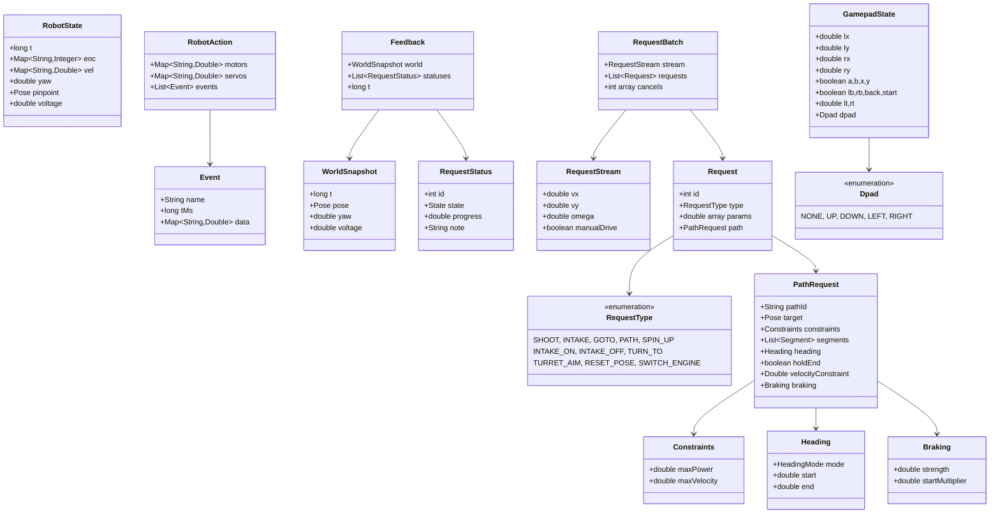
```mermaid
classDiagram
    class RobotState {
      +long t
      +Map~String,Integer~ enc
      +Map~String,Double~ vel
      +double yaw
      +Pose pinpoint
      +double voltage
    }
    class RobotAction {
      +Map~String,Double~ motors
      +Map~String,Double~ servos
      +List~Event~ events
    }
    class Event {
      +String name
      +long tMs
      +Map~String,Double~ data
    }
    class WorldSnapshot {
      +long t
      +Pose pose
      +double yaw
      +double voltage
    }
    class Feedback {
      +WorldSnapshot world
      +List~RequestStatus~ statuses
      +long t
    }
    class GamepadState {
      +double lx
      +double ly
      +double rx
      +double ry
      +boolean a,b,x,y
      +boolean lb,rb,back,start
      +double lt,rt
      +Dpad dpad
    }
    class Request {
      +int id
      +RequestType type
      +double array params
      +PathRequest path
    }
    class RequestBatch {
      +RequestStream stream
      +List~Request~ requests
      +int array cancels
    }
    class RequestStream {
      +double vx
      +double vy
      +double omega
      +boolean manualDrive
    }
    class RequestStatus {
      +int id
      +State state
      +double progress
      +String note
    }
    class RequestType {
      <<enumeration>>
      SHOOT, INTAKE, GOTO, PATH, SPIN_UP
      INTAKE_ON, INTAKE_OFF, TURN_TO
      TURRET_AIM, RESET_POSE, SWITCH_ENGINE
    }
    class Dpad {
      <<enumeration>>
      NONE, UP, DOWN, LEFT, RIGHT
    }
    class PathRequest {
      +String pathId
      +Pose target
      +Constraints constraints
      +List~Segment~ segments
      +Heading heading
      +boolean holdEnd
      +Double velocityConstraint
      +Braking braking
    }
    class Constraints {
      +double maxPower
      +double maxVelocity
    }
    class Heading {
      +HeadingMode mode
      +double start
      +double end
    }
    class Braking {
      +double strength
      +double startMultiplier
    }
    RobotAction --> Event
    Feedback --> WorldSnapshot
    Feedback --> RequestStatus
    RequestBatch --> RequestStream
    RequestBatch --> Request
    Request --> RequestType
    Request --> PathRequest
    PathRequest --> Constraints
    PathRequest --> Heading
    PathRequest --> Braking
    GamepadState --> Dpad
```

Records copy collections at construction.  `RobotState` encoders are integer
ticks, velocities ticks/s, Pinpoint inches/radians, yaw radians, and voltage V;
`RobotAction` carries named motor powers `[-1,1]`, servo positions `[0,1]`, and
events.  `truth` from the simulator never enters `RobotState`.

### HAL and compile-time configuration

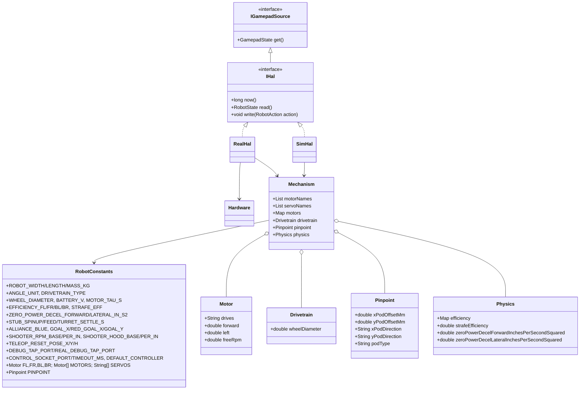
```mermaid
classDiagram
    class IGamepadSource {
      <<interface>>
      +GamepadState get()
    }
    class IHal {
      <<interface>>
      +long now()
      +RobotState read()
      +void write(RobotAction action)
    }
    class RealHal
    class SimHal
    class Hardware
    class Mechanism {
      +List motorNames
      +List servoNames
      +Map motors
      +Drivetrain drivetrain
      +Pinpoint pinpoint
      +Physics physics
    }
    class Motor {
      +String drives
      +double forward
      +double left
      +double freeRpm
    }
    class Drivetrain {
      +double wheelDiameter
    }
    class Pinpoint {
      +double xPodOffsetMm
      +double yPodOffsetMm
      +String xPodDirection
      +String yPodDirection
      +String podType
    }
    class Physics {
      +Map efficiency
      +double strafeEfficiency
      +double zeroPowerDecelForwardInchesPerSecondSquared
      +double zeroPowerDecelLateralInchesPerSecondSquared
    }
    class RobotConstants {
      +ROBOT_WIDTH/LENGTH/MASS_KG
      +ANGLE_UNIT, DRIVETRAIN_TYPE
      +WHEEL_DIAMETER, BATTERY_V, MOTOR_TAU_S
      +EFFICIENCY_FL/FR/BL/BR, STRAFE_EFF
      +ZERO_POWER_DECEL_FORWARD/LATERAL_IN_S2
      +STUB_SPINUP/FEED/TURRET_SETTLE_S
      +ALLIANCE_BLUE, GOAL_X/RED_GOAL_X/GOAL_Y
      +SHOOTER_RPM_BASE/PER_IN, SHOOTER_HOOD_BASE/PER_IN
      +TELEOP_RESET_POSE_X/Y/H
      +DEBUG_TAP_PORT/REAL_DEBUG_TAP_PORT
      +CONTROL_SOCKET_PORT/TIMEOUT_MS, DEFAULT_CONTROLLER
      +Motor FL,FR,BL,BR; Motor[] MOTORS; String[] SERVOS
      +Pinpoint PINPOINT
    }
    IGamepadSource <|-- IHal
    IHal <|.. RealHal
    IHal <|.. SimHal
    RealHal --> Hardware
    RealHal --> Mechanism
    SimHal --> Mechanism
    Mechanism --> RobotConstants
    Mechanism o-- Motor
    Mechanism o-- Drivetrain
    Mechanism o-- Pinpoint
    Mechanism o-- Physics
```

`RealHal` owns FTC devices; `SimHal` owns the TCP client and simulator clock.
`now()` is a monotonic HAL-clock millisecond value; `read()` returns one
`RobotState`, and `write()` applies one complete `RobotAction`.
`RobotConstants.java` is the single compile-time configuration source: geometry,
motor declarations, Pinpoint, battery, lag, efficiency, deceleration, goals,
reset pose, and socket ports.  Python `mechanism.py` reads its scalar/string,
servo, and one-line motor declarations with regular expressions.

The reader's line-format contract is deliberately narrow (one declaration per
physical line):

```text
public static final double NAME = value;
public static final String NAME = "value";
public static final Motor FL = new Motor("fl", "wheel", xForward, yLeft, rollerDeg, ticksPerRev, freeRpm);
public static final String[] SERVOS = {};
public static final Pinpoint PINPOINT = new Pinpoint(xOffsetMm, yOffsetMm, xDirection, yDirection, podType);
```

Python requires `ROBOT_WIDTH`, `ROBOT_LENGTH`, `WHEEL_DIAMETER`, `BATTERY_V`,
`MOTOR_TAU_S`, `STRAFE_EFF`, and both `ZERO_POWER_DECEL_*` scalars; it defaults
missing motor efficiency to `1.0`, preserves motor declaration order, and does not parse
`PINPOINT` (Java consumes that record). `ROBOT_MASS_KG` is a Java constant but
is not yet stored in the Python mechanism model.

`Intent`, sealed `Drive` variants, `MechanismLoader`, and `mechanism.yaml` are
not current interfaces.  The YAML decision is closed: compile-time Java
constants make configuration errors fail during compilation and remove a
runtime parser/moving part.

### Subsystem interfaces, Pedro bridge, and stubs

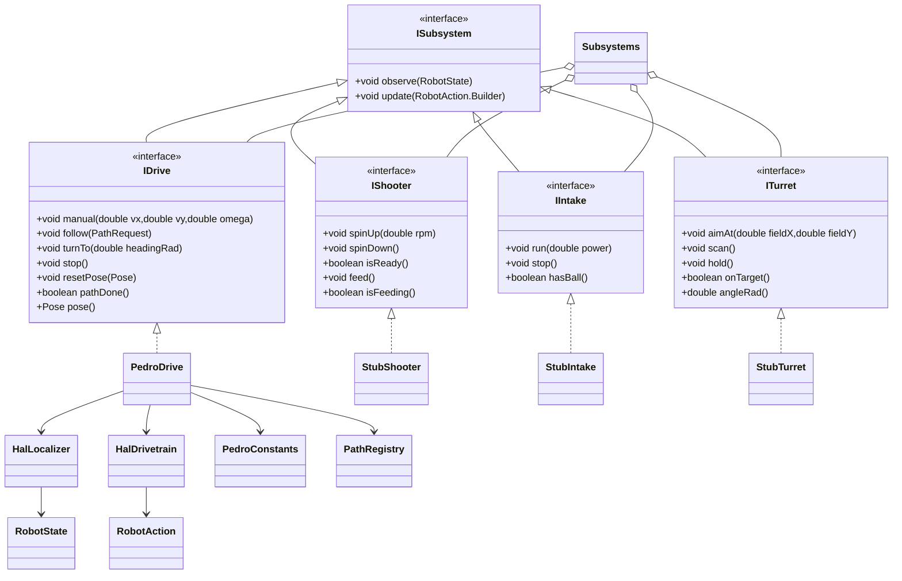
```mermaid
classDiagram
    class ISubsystem {
      <<interface>>
      +void observe(RobotState)
      +void update(RobotAction.Builder)
    }
    class IDrive {
      <<interface>>
      +void manual(double vx,double vy,double omega)
      +void follow(PathRequest)
      +void turnTo(double headingRad)
      +void stop()
      +void resetPose(Pose)
      +boolean pathDone()
      +Pose pose()
    }
    class IShooter {
      <<interface>>
      +void spinUp(double rpm)
      +void spinDown()
      +boolean isReady()
      +void feed()
      +boolean isFeeding()
    }
    class IIntake {
      <<interface>>
      +void run(double power)
      +void stop()
      +boolean hasBall()
    }
    class ITurret {
      <<interface>>
      +void aimAt(double fieldX,double fieldY)
      +void scan()
      +void hold()
      +boolean onTarget()
      +double angleRad()
    }
    class Subsystems
    class PedroDrive
    class HalLocalizer
    class HalDrivetrain
    class PedroConstants
    class PathRegistry
    class StubShooter
    class StubIntake
    class StubTurret
    ISubsystem <|-- IDrive
    ISubsystem <|-- IShooter
    ISubsystem <|-- IIntake
    ISubsystem <|-- ITurret
    IDrive <|.. PedroDrive
    IShooter <|.. StubShooter
    IIntake <|.. StubIntake
    ITurret <|.. StubTurret
    Subsystems o-- IDrive
    Subsystems o-- IShooter
    Subsystems o-- IIntake
    Subsystems o-- ITurret
    PedroDrive --> HalLocalizer
    PedroDrive --> HalDrivetrain
    PedroDrive --> PedroConstants
    PedroDrive --> PathRegistry
    HalLocalizer --> RobotState
    HalDrivetrain --> RobotAction
```

`Subsystems.observe` samples all four mechanisms, then `update` assembles one
action in drive/shooter/intake/turret order.  Pedro classes translate the
contract to Pedro 3.0; stubs provide timing/events until real mechanisms land.
To add one: define a narrow `I... extends ISubsystem`, add a stub/real
implementation, add its field and fixed-order calls to `Subsystems`, construct
it in `RobotFactory`, then map requests in the owning engine and test it.

### Logic engines and modules

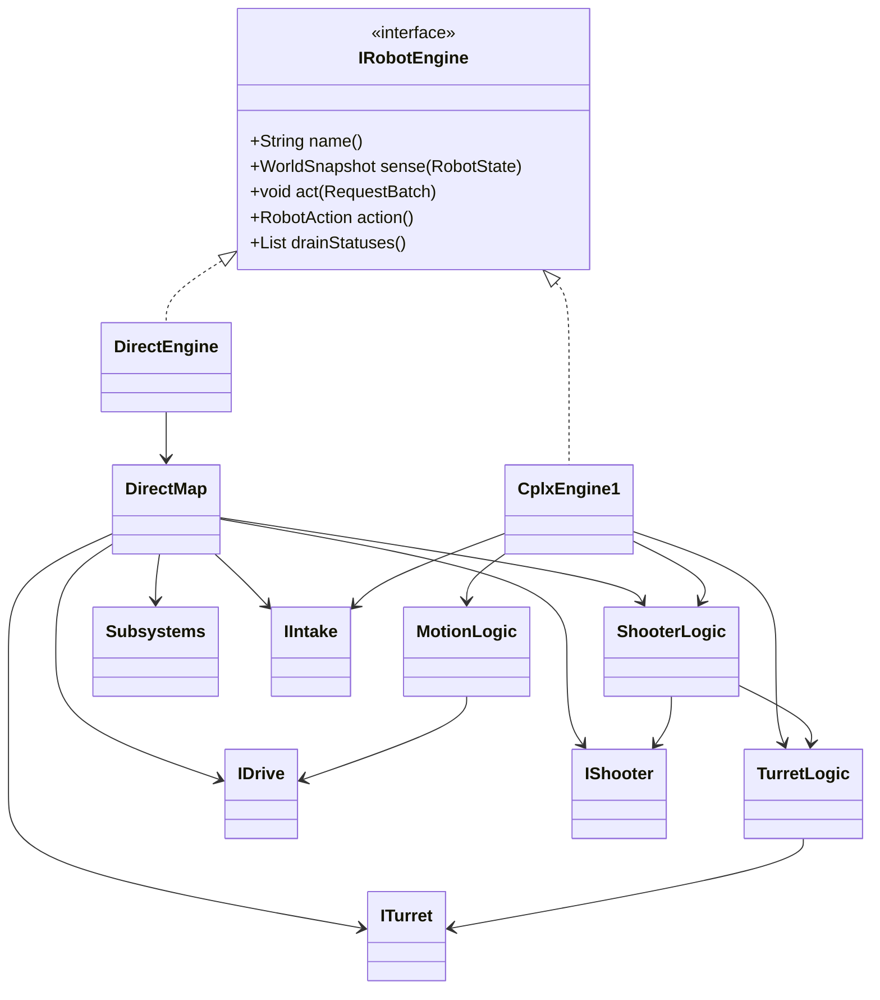
```mermaid
classDiagram
    class IRobotEngine {
      <<interface>>
      +String name()
      +WorldSnapshot sense(RobotState)
      +void act(RequestBatch)
      +RobotAction action()
      +List drainStatuses()
    }
    class DirectEngine
    class DirectMap
    class CplxEngine1
    class MotionLogic
    class TurretLogic
    class ShooterLogic
    class Subsystems
    class IDrive
    class IShooter
    class IIntake
    class ITurret
    IRobotEngine <|.. DirectEngine
    IRobotEngine <|.. CplxEngine1
    DirectEngine --> DirectMap
    DirectMap --> Subsystems
    DirectMap --> ShooterLogic
    DirectMap --> IDrive
    DirectMap --> IShooter
    DirectMap --> IIntake
    DirectMap --> ITurret
    CplxEngine1 --> MotionLogic
    CplxEngine1 --> TurretLogic
    CplxEngine1 --> ShooterLogic
    CplxEngine1 --> IIntake
    MotionLogic --> IDrive
    TurretLogic --> ITurret
    ShooterLogic --> IShooter
    ShooterLogic --> TurretLogic
```

`DirectEngine` owns wiring, stream arbitration, and two direct jobs.  `CplxEngine1`
delegates motion, automatic turret tracking, shooter sequencing, and intake;
both engines share one `Subsystems` instance.  `DirectMap` uses only the static
calibrated-RPM helper from `ShooterLogic`; job state is not shared.
The drive surface today is Manual/Velocity (the level stream), GoTo (`GOTO`),
FollowPath (`PATH`), TurnTo, and Hold (no active request or `holdEnd`).

### Controllers, FTC opmodes, replay, and socket input

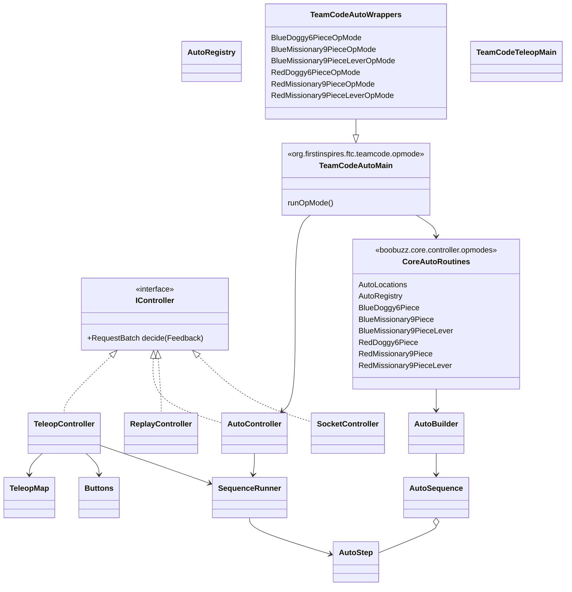
```mermaid
classDiagram
    class IController {
      <<interface>>
      +RequestBatch decide(Feedback)
    }
    class TeleopController
    class TeleopMap
    class Buttons
    class AutoController
    class AutoBuilder
    class AutoSequence
    class AutoStep
    class SequenceRunner
    class AutoRegistry
    class CoreAutoRoutines {
      <<boobuzz.core.controller.opmodes>>
      AutoLocations
      AutoRegistry
      BlueDoggy6Piece
      BlueMissionary9Piece
      BlueMissionary9PieceLever
      RedDoggy6Piece
      RedMissionary9Piece
      RedMissionary9PieceLever
    }
    class TeamCodeAutoMain {
      <<org.firstinspires.ftc.teamcode.opmode>>
      runOpMode()
    }
    class TeamCodeAutoWrappers {
      BlueDoggy6PieceOpMode
      BlueMissionary9PieceOpMode
      BlueMissionary9PieceLeverOpMode
      RedDoggy6PieceOpMode
      RedMissionary9PieceOpMode
      RedMissionary9PieceLeverOpMode
    }
    class TeamCodeTeleopMain
    class ReplayController
    class SocketController
    IController <|.. TeleopController
    IController <|.. AutoController
    IController <|.. ReplayController
    IController <|.. SocketController
    TeleopController --> TeleopMap
    TeleopController --> Buttons
    TeleopController --> SequenceRunner
    AutoController --> SequenceRunner
    AutoBuilder --> AutoSequence
    AutoSequence o-- AutoStep
    SequenceRunner --> AutoStep
    CoreAutoRoutines --> AutoBuilder
    TeamCodeAutoMain --> AutoController
    TeamCodeAutoMain --> CoreAutoRoutines
    TeamCodeAutoWrappers --|> TeamCodeAutoMain
```

Controllers see `Feedback` and return `RequestBatch`; they do not see HAL or
subsystems.  `TeleopController` can run a Y-started sequence in the background;
`TeamCodeAutoMain` supplies the six registry-backed FTC entry points.  Replay consumes
JSONL seam batches; `SocketController` exchanges feedback and batches off-thread,
and emits one `CANCEL_ALL` after its receive timeout.

## 3. Contracts and control flow

### Inter-module seam (allowed directions)

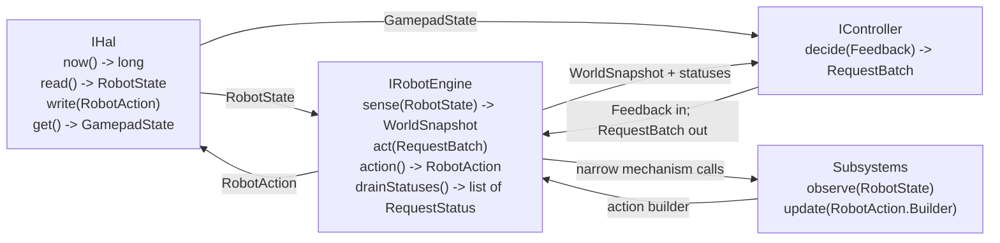
```mermaid
flowchart LR
    H["IHal<br/>now() -> long<br/>read() -> RobotState<br/>write(RobotAction)<br/>get() -> GamepadState"]
    C["IController<br/>decide(Feedback) -> RequestBatch"]
    E["IRobotEngine<br/>sense(RobotState) -> WorldSnapshot<br/>act(RequestBatch)<br/>action() -> RobotAction<br/>drainStatuses() -> list of RequestStatus"]
    S["Subsystems<br/>observe(RobotState)<br/>update(RobotAction.Builder)"]
    H -->|RobotState| E
    H -->|GamepadState| C
    E -->|WorldSnapshot + statuses| C
    C -->|Feedback in; RequestBatch out| E
    E -->|narrow mechanism calls| S
    S -->|action builder| E
    E -->|RobotAction| H
```

Only `RobotLoop` calls the arrows in order; controllers never call a subsystem,
and engines never open the JSON socket.  `RobotConstants`/`Mechanism` are
construction data, not a mutable cross-module bus.

### RequestStatus lifecycle

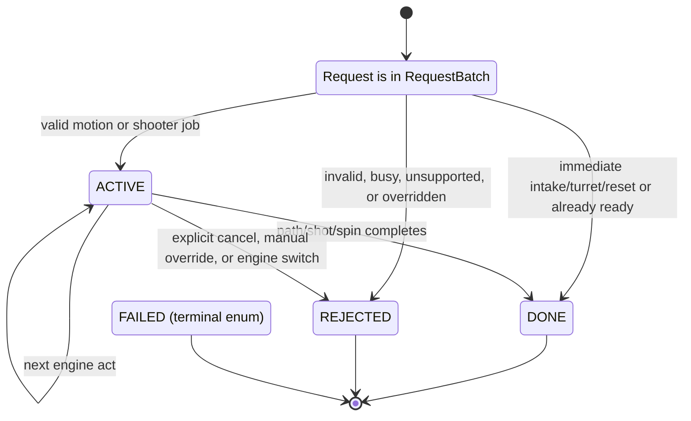
```mermaid
stateDiagram-v2
    [*] --> DISPATCHED
    DISPATCHED: Request is in RequestBatch
    DISPATCHED --> ACTIVE: valid motion or shooter job
    DISPATCHED --> DONE: immediate intake/turret/reset or already ready
    DISPATCHED --> REJECTED: invalid, busy, unsupported, or overridden
    ACTIVE --> ACTIVE: next engine act
    ACTIVE --> DONE: path/shot/spin completes
    ACTIVE --> REJECTED: explicit cancel, manual override, or engine switch
    state "FAILED (terminal enum)" as FAILED
    DONE --> [*]
    REJECTED --> [*]
    FAILED --> [*]
```

`RequestStatus` fields are `(id,state,progress,note)`; terminal states are
`DONE`, `FAILED`, and `REJECTED`.  The controller receives statuses on the next
tick through `Feedback`; current code emits `ACTIVE`, `DONE`, and `REJECTED`.

### Level stream versus edge request

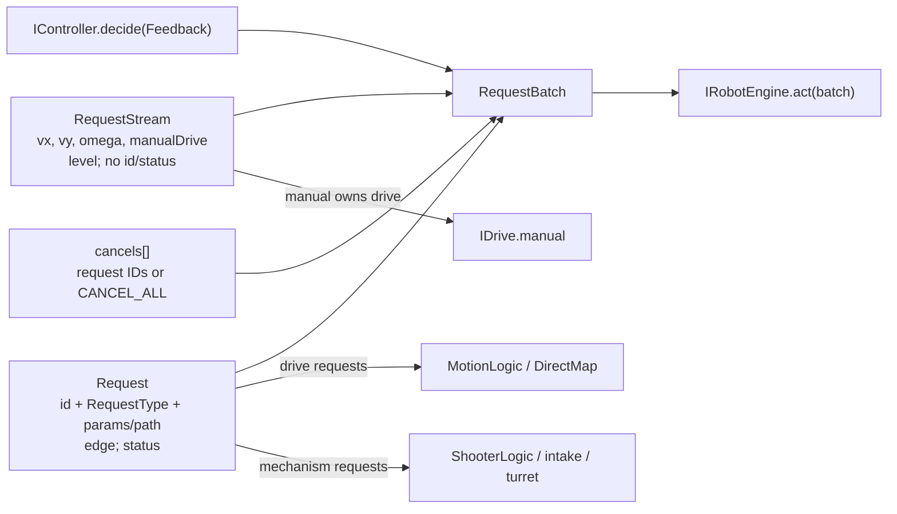
```mermaid
flowchart LR
    C["IController.decide(Feedback)"] --> B["RequestBatch"]
    S["RequestStream<br/>vx, vy, omega, manualDrive<br/>level; no id/status"] --> B
    R["Request<br/>id + RequestType + params/path<br/>edge; status"] --> B
    X["cancels[]<br/>request IDs or CANCEL_ALL"] --> B
    B --> E["IRobotEngine.act(batch)"]
    S -->|manual owns drive| M["IDrive.manual"]
    R -->|drive requests| D["MotionLogic / DirectMap"]
    R -->|mechanism requests| Q["ShooterLogic / intake / turret"]
```

`RequestStream` is present every tick, including idle; `Request` objects are
edge-triggered and immutable.  Manual stream input cancels an active drive and
rejects a simultaneous drive request; `CANCEL_ALL` is reserved for handoff.

### Teleop gamepad to request map

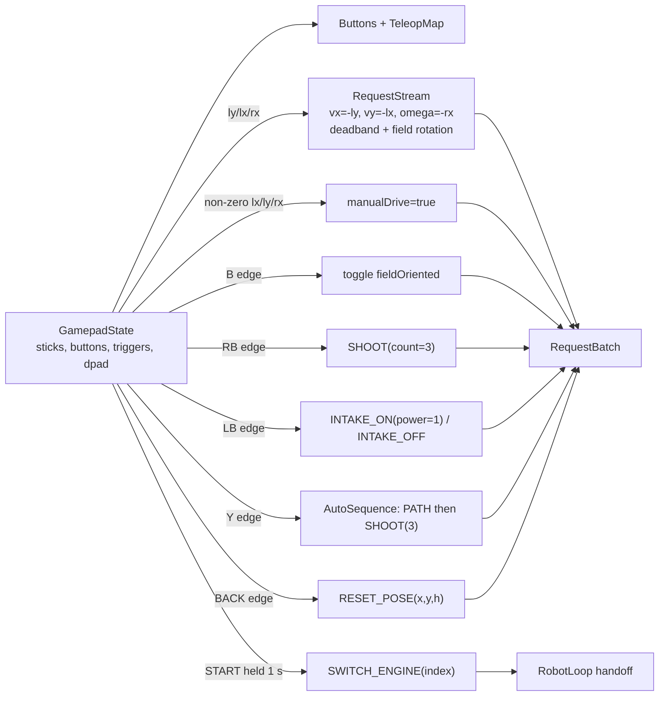
```mermaid
flowchart LR
    G["GamepadState<br/>sticks, buttons, triggers, dpad"] --> T["Buttons + TeleopMap"]
    G -->|ly/lx/rx| V["RequestStream<br/>vx=-ly, vy=-lx, omega=-rx<br/>deadband + field rotation"]
    G -->|non-zero lx/ly/rx| MD["manualDrive=true"]
    G -->|B edge| FO["toggle fieldOriented"]
    G -->|RB edge| SH["SHOOT(count=3)"]
    G -->|LB edge| IN["INTAKE_ON(power=1) / INTAKE_OFF"]
    G -->|Y edge| Y["AutoSequence: PATH then SHOOT(3)"]
    G -->|BACK edge| RP["RESET_POSE(x,y,h)"]
    G -->|START held 1 s| SW["SWITCH_ENGINE(index)"]
    V --> B["RequestBatch"]
    MD --> B
    FO --> B
    SH --> B
    IN --> B
    Y --> B
    RP --> B
    SW --> L["RobotLoop handoff"]
```

The map starts field-oriented, applies a 0.05 deadband, and allocates teleop
IDs from 10,000.  A Y sequence moves +12 inches at its current heading then
shoots three; a real stick sample aborts it.  A/B/X/RY/LT/RT/D-pad are currently
unmapped.

Shared state is intentionally small: immutable static `RobotConstants`, the
immutable `Mechanism.DEFAULT`, and per-loop engine jobs/statuses plus private
subsystem state.  Python keeps per-backend pose/RNG/logs.  There is no singleton
engine, global request queue, or shared truth pose; engine switching reuses the
same `Subsystems` object.

## 4. Logic state machines

### `cplx_engine_N` siblings

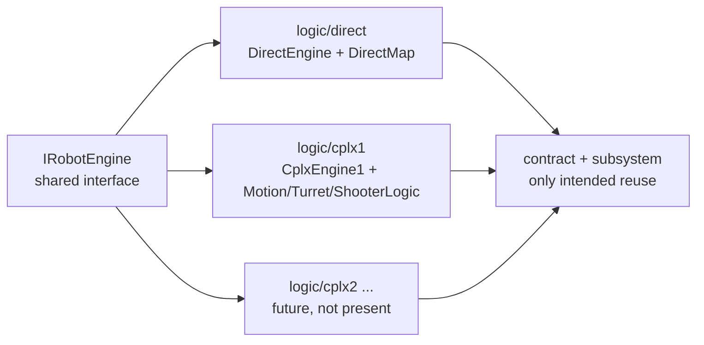
```mermaid
flowchart LR
    I["IRobotEngine<br/>shared interface"]
    D["logic/direct<br/>DirectEngine + DirectMap"]
    C1["logic/cplx1<br/>CplxEngine1 + Motion/Turret/ShooterLogic"]
    C2["logic/cplx2 ...<br/>future, not present"]
    K["contract + subsystem<br/>only intended reuse"]
    I --> D
    I --> C1
    I --> C2
    D --> K
    C1 --> K
    C2 --> K
```

Each `cplx_engine_N` is a sibling implementation folder; siblings do not import
one another or share engine state.  The canonical current name is `cplx1`; the
historical `cplx_engine_1` string remains an input alias in `RobotFactory`.

### ShooterLogic

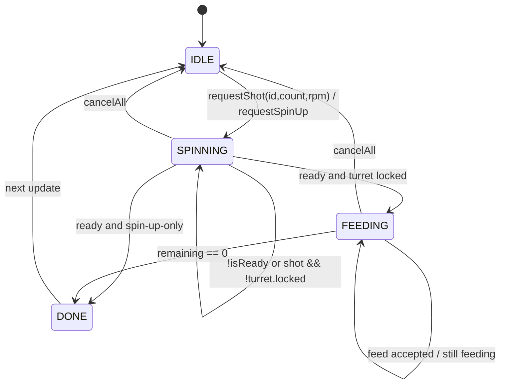
```mermaid
stateDiagram-v2
    [*] --> IDLE
    IDLE --> SPINNING: requestShot(id,count,rpm) / requestSpinUp
    SPINNING --> SPINNING: !isReady or shot && !turret.locked
    SPINNING --> DONE: ready and spin-up-only
    SPINNING --> FEEDING: ready and turret locked
    FEEDING --> FEEDING: feed accepted / still feeding
    FEEDING --> DONE: remaining == 0
    SPINNING --> IDLE: cancelAll
    FEEDING --> IDLE: cancelAll
    DONE --> IDLE: next update
```

`CplxEngine1` validates count/RPM, then `ShooterLogic` owns aiming, RPM/hood
selection, feed count, and statuses.  The direct engine uses the same
count-only calibrated RPM helper when no RPM parameter is supplied.

### TurretLogic track, scan, and hold

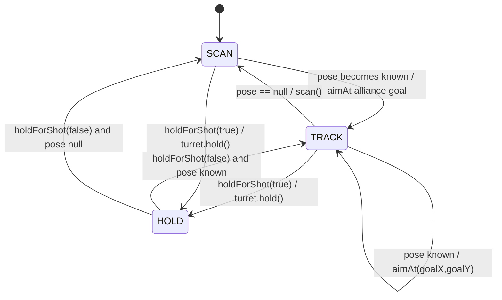
```mermaid
stateDiagram-v2
    [*] --> SCAN
    SCAN --> TRACK: pose becomes known / aimAt alliance goal
    TRACK --> TRACK: pose known / aimAt(goalX,goalY)
    TRACK --> SCAN: pose == null / scan()
    TRACK --> HOLD: holdForShot(true) / turret.hold()
    SCAN --> HOLD: holdForShot(true) / turret.hold()
    HOLD --> TRACK: holdForShot(false) and pose known
    HOLD --> SCAN: holdForShot(false) and pose null
```

There is no public enum: `holdingForShot` and `targetKnown` are the state.  The
goal is `(GOAL_X,GOAL_Y)` for blue or `(RED_GOAL_X,GOAL_Y)` for red; controllers
never issue turret commands directly.

### MotionLogic drive arbitration

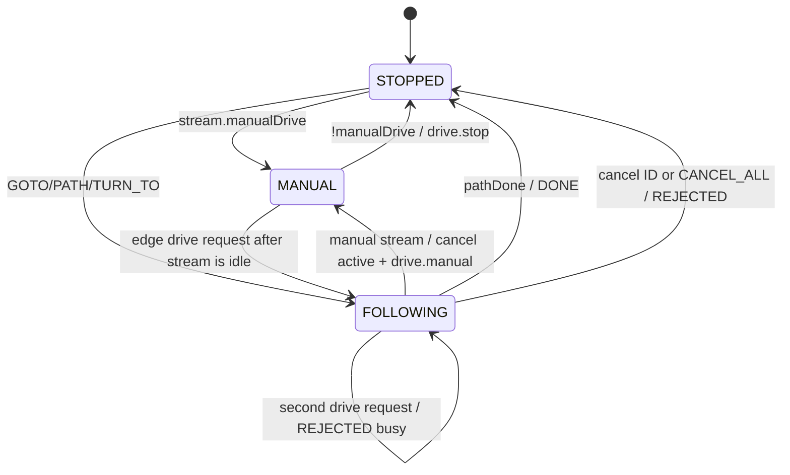
```mermaid
stateDiagram-v2
    [*] --> STOPPED
    STOPPED --> MANUAL: stream.manualDrive
    STOPPED --> FOLLOWING: GOTO/PATH/TURN_TO
    FOLLOWING --> MANUAL: manual stream / cancel active + drive.manual
    FOLLOWING --> STOPPED: pathDone / DONE
    FOLLOWING --> STOPPED: cancel ID or CANCEL_ALL / REJECTED
    MANUAL --> STOPPED: !manualDrive / drive.stop
    MANUAL --> FOLLOWING: edge drive request after stream is idle
    FOLLOWING --> FOLLOWING: second drive request / REJECTED busy
```

DirectEngine performs the same arbitration around `DirectMap`; both paths give
manual input priority.  Motion requests validate their payload before creating
an active job, and `RESET_POSE` cancels active motion before resetting the
software/localizer pose.

### Engine switch

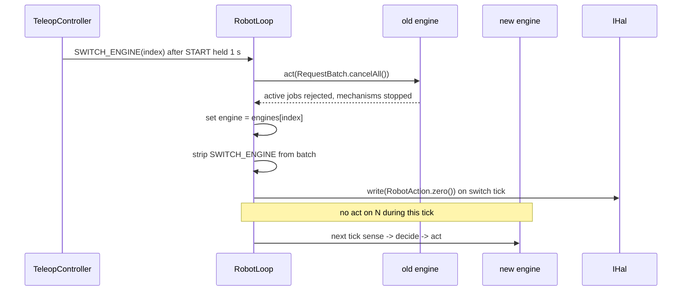
```mermaid
sequenceDiagram
    participant C as TeleopController
    participant L as RobotLoop
    participant O as old engine
    participant N as new engine
    participant H as IHal
    C->>L: SWITCH_ENGINE(index) after START held 1 s
    L->>O: act(RequestBatch.cancelAll())
    O-->>L: active jobs rejected, mechanisms stopped
    L->>L: set engine = engines[index]
    L->>L: strip SWITCH_ENGINE from batch
    L->>H: write(RobotAction.zero()) on switch tick
    Note over L,N: no act on N during this tick
    L->>N: next tick sense -> decide -> act
```

`RobotFactory` orders index 0 = `DirectEngine`, index 1 = `CplxEngine1` over
one shared `Subsystems` object.  The loop, not either engine, consumes the
switch request.

## 5. Simulator

### SimHal and Python server protocol

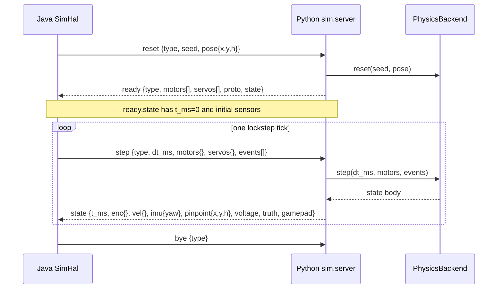
```mermaid
sequenceDiagram
    participant J as Java SimHal
    participant P as Python sim.server
    participant B as PhysicsBackend
    J->>P: reset {type, seed, pose{x,y,h}}
    P->>B: reset(seed, pose)
    P-->>J: ready {type, motors[], servos[], proto, state}
    Note over J,P: ready.state has t_ms=0 and initial sensors
    loop one lockstep tick
        J->>P: step {type, dt_ms, motors{}, servos{}, events[]}
        P->>B: step(dt_ms, motors, events)
        B-->>P: state body
        P-->>J: state {t_ms, enc{}, vel{}, imu{yaw}, pinpoint{x,y,h}, voltage, truth, gamepad}
    end
    J->>P: bye {type}
```

TCP is line-delimited JSON on `127.0.0.1:5555`; Java supplies positive
`dt_ms`, so physics advances exactly once per `step`.  `events[]` entries are
`{name,t_ms,data{}}`; `truth` is viewer/test-only and is retained only in
`SimHal.truth`, not copied into `RobotState`.  Multi-robot mode uses one port per robot and the same
message shapes.

| Message | Fields on the wire | Semantics |
|---|---|---|
| Java → Python `reset` | `type`, `seed`, `pose{x,y,h}` | Seeded reset; lengths inches, heading radians; missing pose values default to zero. |
| Python → Java `ready` | `type`, `motors[]`, `servos[]`, `proto`, `state` | Names must match `Mechanism`; nested initial state has `t_ms=0`. |
| Java → Python `step` | `type`, positive `dt_ms`, `motors{}`, `servos{}`, `events[]` | Powers are `[-1,1]`; servo positions `[0,1]`; one physics tick. |
| Python → Java `state` | `type`, `t_ms`, `enc{}`, `vel{}`, `imu{yaw}`, `pinpoint{x,y,h}`, `voltage`, `truth{x,y,h}`, `gamepad{lx,ly,rx,ry,a,b,x,y,lb,rb,back,start,lt,rt,dpad}` | Ticks and ticks/s; pose lengths inches/radians; voltage V; gamepad sticks `[-1,1]`, triggers `[0,1]`. |
| Java → Python `bye` | `type` | Close; no reply. |

### Python physics backend classes

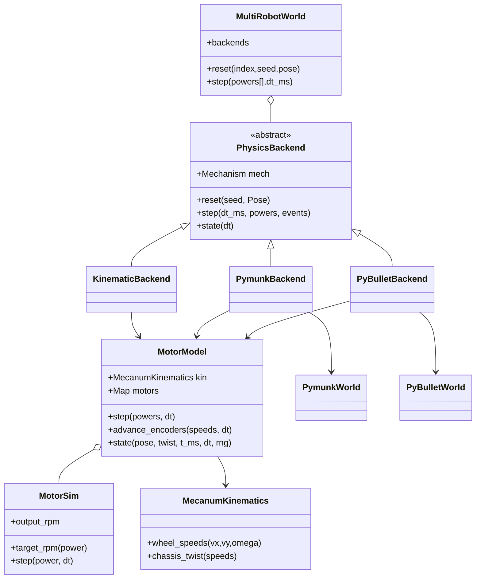
```mermaid
classDiagram
    class PhysicsBackend {
      <<abstract>>
      +Mechanism mech
      +reset(seed, Pose)
      +step(dt_ms, powers, events)
      +state(dt)
    }
    class MotorModel {
      +MecanumKinematics kin
      +Map motors
      +step(powers, dt)
      +advance_encoders(speeds, dt)
      +state(pose, twist, t_ms, dt, rng)
    }
    class MotorSim {
      +target_rpm(power)
      +step(power, dt)
      +output_rpm
    }
    class MecanumKinematics {
      +wheel_speeds(vx,vy,omega)
      +chassis_twist(speeds)
    }
    class KinematicBackend
    class PymunkBackend
    class PyBulletBackend
    class PymunkWorld
    class PyBulletWorld
    class MultiRobotWorld {
      +backends
      +reset(index,seed,pose)
      +step(powers[],dt_ms)
    }
    PhysicsBackend <|-- KinematicBackend
    PhysicsBackend <|-- PymunkBackend
    PhysicsBackend <|-- PyBulletBackend
    MotorModel o-- MotorSim
    MotorModel --> MecanumKinematics
    KinematicBackend --> MotorModel
    PymunkBackend --> MotorModel
    PyBulletBackend --> MotorModel
    PymunkBackend --> PymunkWorld
    PyBulletBackend --> PyBulletWorld
    MultiRobotWorld o-- PhysicsBackend
```

All backends share `MotorSim` (power clamp, calibrated free RPM, first-order
lag `MOTOR_TAU_S=0.1 s`), roller-angle mecanum kinematics, integer encoders,
and seeded noisy Pinpoint/IMU state.  Pymunk is the default rigid body;
PyBullet is optional; kinematic is the Euler comparison baseline.

### Multi-robot lockstep (`--robots N`)

```mermaid
sequenceDiagram
    participant C0 as client 0 :5555
    participant CN as client N-1 :5555+N-1
    participant S as SimServer
    participant W as MultiRobotWorld
    C0->>S: reset(seed,pose) on port+0
    CN->>S: reset(seed,pose) on port+N-1
    S-->>C0: ready(state0)
    S-->>CN: ready(stateN)
    par same tick
        C0->>S: step(dt_ms,powers0,events0)
        CN->>S: step(dt_ms,powersN,eventsN)
    end
    S->>S: wait until every ready client has pending step
    S->>W: step([powers0,...,powersN], same dt_ms)
    W-->>S: advance shared world/backends once
    S-->>C0: state0 + gamepad
    S-->>CN: stateN + gamepad
```

The server rejects mismatched `dt_ms`, advances only after all connected/ready
slots in the current reset epoch submit, and evicts silent clients after the
lockstep deadline.  Resetting one body does not reset the others; a late client
starts a new reset barrier.  Pymunk and PyBullet share one world; kinematic
backends step independently in the same barrier.

### Simulator capabilities and calibration

```mermaid
flowchart LR
    RC["RobotConstants.java<br/>same source as Java"] --> MR["mechanism.py regex reader"]
    MR --> MM["MotorModel + wheel geometry"]
    MM --> K["kinematic backend"]
    MM --> PM["Pymunk rigid body"]
    MM --> PB["PyBullet planar body"]
    K --> O["enc / Pinpoint / IMU / voltage / truth"]
    PM --> O
    PB --> O
    O --> V["pygame viewer or --headless"]
```

The field is 144 x 144 inches; pose and Pinpoint are inches/radians.  Current
calibration is `STRAFE_EFF=0.7346`, forward/lateral zero-power deceleration
`36.17/85.98 in/s2`, battery `12 V`, wheel roller angles +/-45 degrees, and
wheel positions +/-6.5 forward and +/-5.5 left.  The model does not simulate
shooter/intake/turret physics, voltage sag, current draw, or back-EMF; Java
stubs emit mechanism timing events instead.

| Calibration | Value | Origin |
|---|---:|---|
| `ROBOT_WIDTH`, `ROBOT_LENGTH` | 18.0 in, 18.0 in | current chassis constants |
| `ROBOT_MASS_KG` | 12.0 kg | Java constant; rigid backends currently use literal 12.0 |
| `WHEEL_DIAMETER` | 4.0 in | current wheel geometry |
| `BATTERY_V`, `MOTOR_TAU_S` | 12.0 V, 0.1 s | compile-time simulation defaults |
| `STRAFE_EFF` | 0.7346 | last season `yVelocity/xVelocity = 54.09/73.63` |
| zero-power decel (forward/lateral) | 36.17 / 85.98 in/s² | last season's `Constants.java` magnitudes |
| roller angles | +45° / -45° | `RobotConstants` motor declarations; Python converts to radians |
| wheel positions | ±6.5 forward, ±5.5 left in | `RobotConstants` motor declarations |
| ticks/rev; free RPM | 537.7; 351.55735379568756 | declarations; RPM derived from 73.63 in/s, no direct RPM measurement |
| wheel efficiency FL/FR/BL/BR | 1.0 each | placeholder, not measured |
| Pinpoint | (161.0, 0.0) mm; FORWARD/REVERSED; `goBILDA_4_BAR_POD` | last season's `archive/ftc/de-cock/.../Constants.java`; re-measure chassis |
| stub timing | spin-up 0.5 s; feed 0.2 s; turret settle 0.3 s | Java timing-only stubs |

## 6. Build and run

### Gradle and SDK guard

```mermaid
flowchart LR
    S["settings.gradle"] --> C[":core<br/>TeamCode/core<br/>Java 17"]
    S --> J[":sim<br/>Java 17"]
    S --> T[":TeamCode<br/>Android FTC"]
    J -->|core dependency| C
    T -->|Android shell| C
    G["gradle/sdk-guard.gradle"] --> C
    G --> J
    G -->|fail before compileJava on FTC/Android names| X["build error"]
```

`:core` is a Java library with Pedro 3.0 core; `:sim` is an application and
never depends on `:TeamCode`.  The guard scans main/test sources for
`com.qualcomm`, `org.firstinspires`, or `android.` before compilation.

```text
export JAVA_HOME=/usr/lib/jvm/java-21-openjdk
# from robot-code/
./gradlew :core:test :sim:test
./gradlew :sim:run --args="--headless --steps 500 --dt 20"
cd ../re-cock-nize
python -m sim.server --headless --physics pymunk
cd ../robot-code
./gradlew :sim:run --args="--controller replay --bag run.jsonl --steps 500"
```

`architecture/build.sh` uses installed `mmdc` plus Chrome to emit labeled SVG
and tight PDF diagrams, then invokes Pandoc with a real TeX engine.  No package manager or browser
download is part of the build.

## Appendix B — open decisions

- Freeze the Request/Feedback contract after the current R3/R4 seam review.
- Confirm Pinpoint offsets: `161/0` mm in `RobotConstants` versus the proposed
  `-84/-168` mm measurement.
- Resolve Android Studio synchronization for nested Gradle project `:core`.
- Fold duplicate `RobotConstants.Motor/Pinpoint` and `Mechanism.Motor/Pinpoint`
  records in the next cleanup.
- Define whether `RequestStatus.FAILED` should gain an engine emitter; current
  engines reject invalid/cancelled work but do not emit `FAILED`.

## Appendix C — methodology and limits

- Source-of-truth is the checked-out Java/Python code; diagrams do not invent
  behavior for unimplemented seams.
- Documentation work uses hierarchical agents coordinated through `bp`, as
  described in the repository README; each claim is checked against source.
- `protokol.md` and design decisions remain owned by `ftc-main`; this document
  records the implementation boundary and current open choices.
