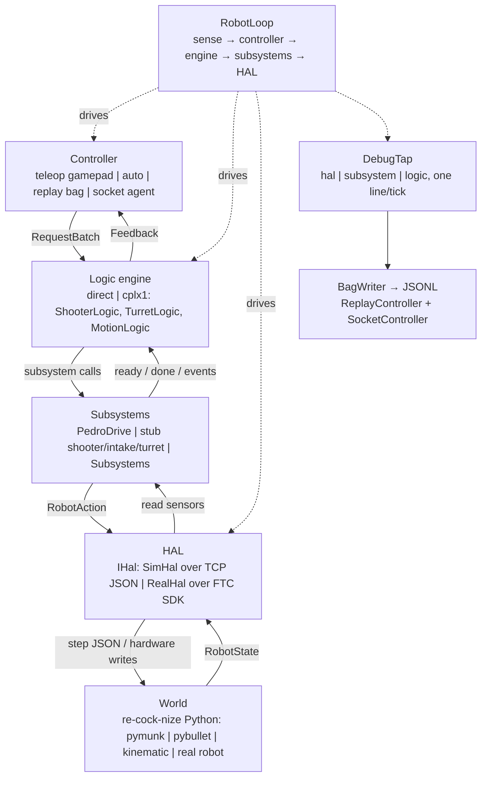
```{=latex}
\clearpage
```

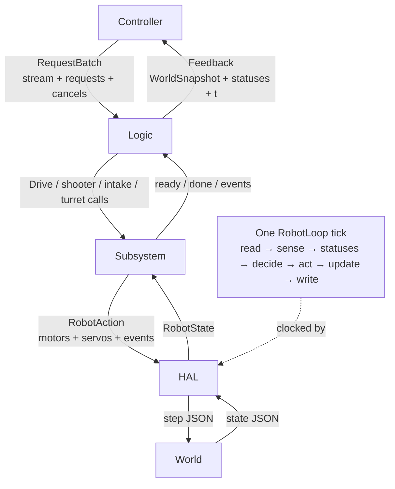
```{=latex}
\clearpage
```
## Seam records

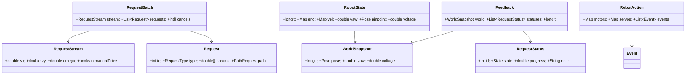

The immutable records are the only cross-layer vocabulary.  `PATH` alone carries
`PathRequest`; `CANCEL_ALL` is `Integer.MIN_VALUE`.

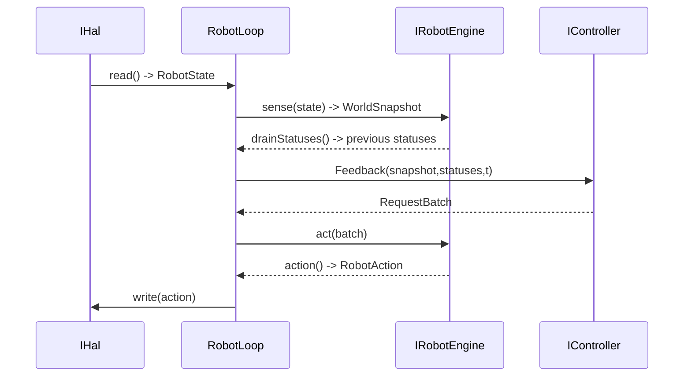
## Package and engines

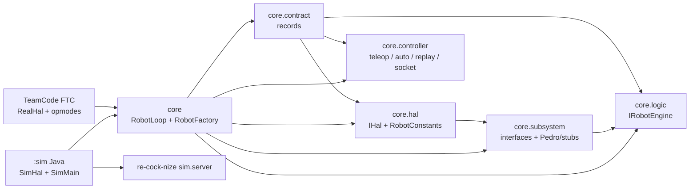

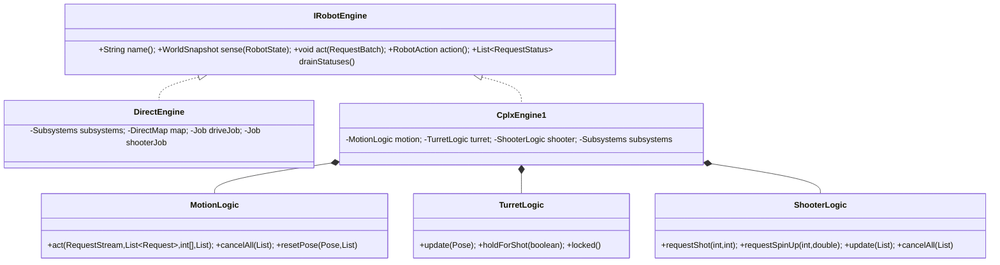

Direct maps each edge request with `DirectMap`; cplx1 delegates policy to three
logic modules over one `Subsystems` record.

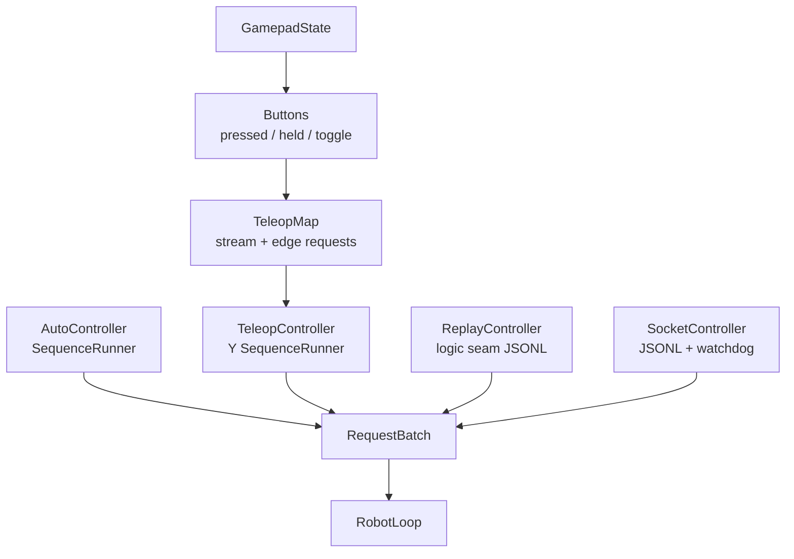
## Requests and arbitration

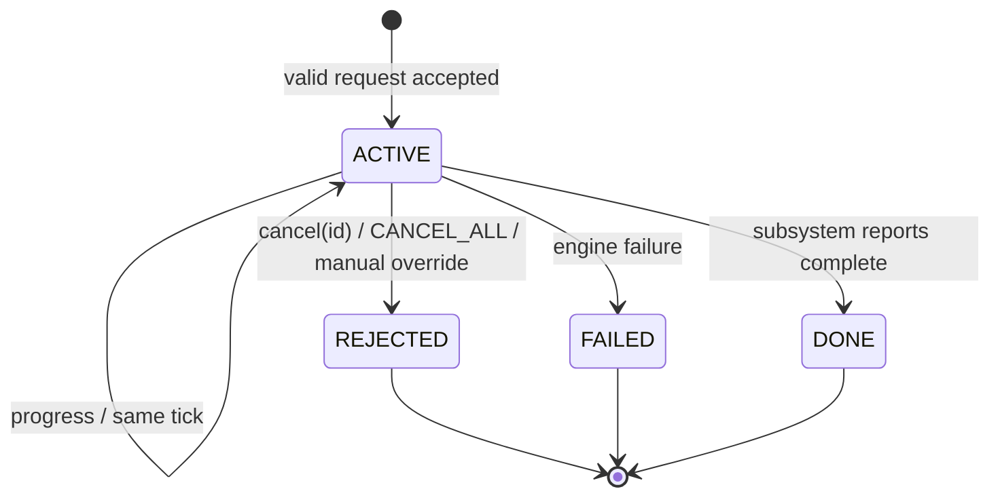

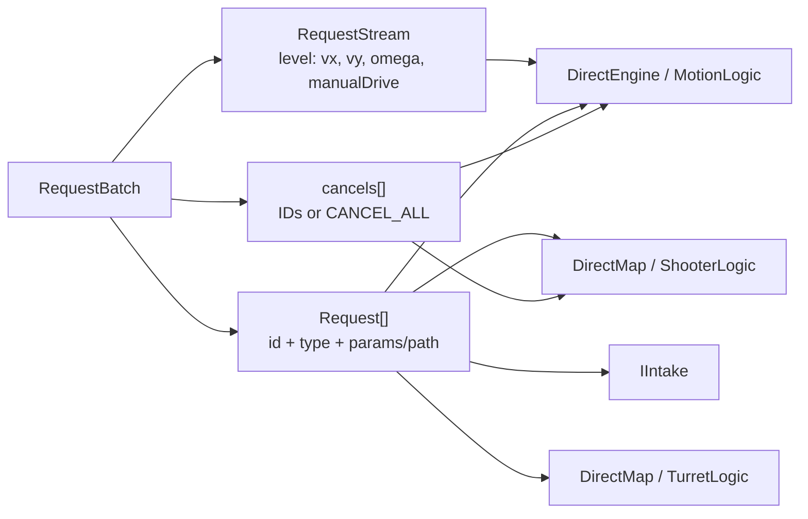

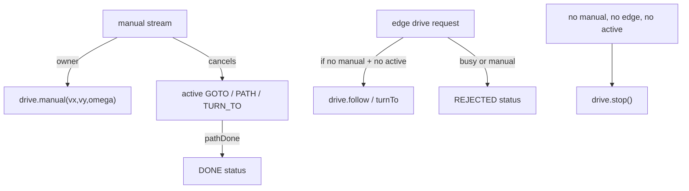

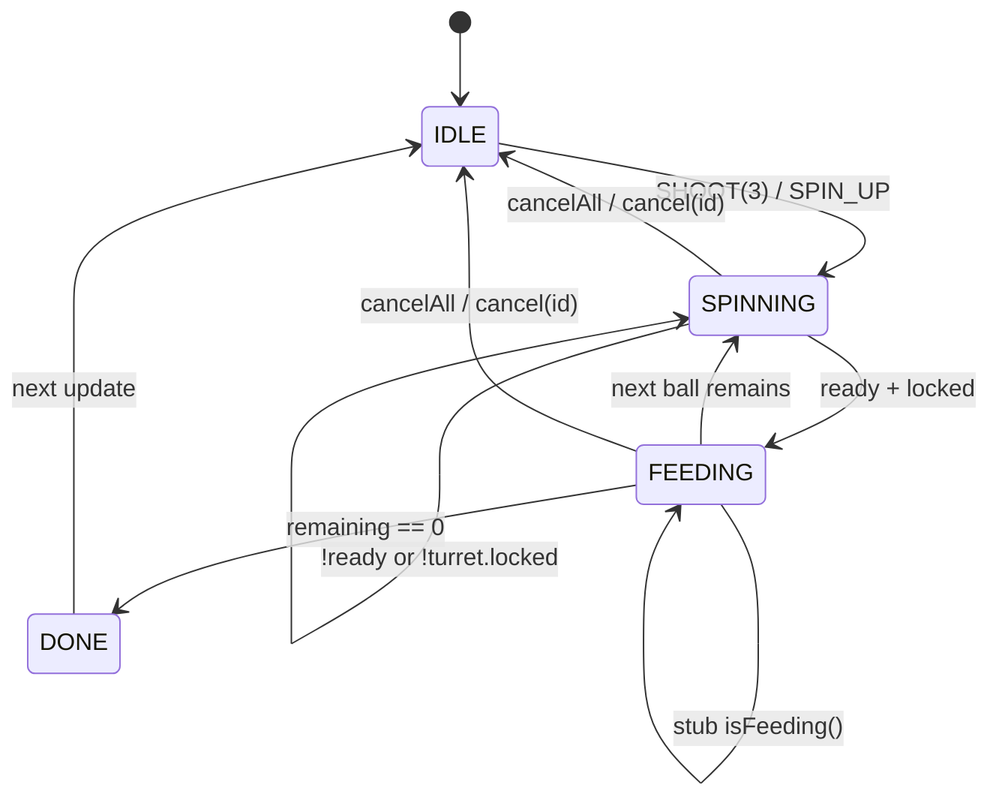
```mermaid
stateDiagram-v2
    [*] --> AIM
    AIM: targetKnown = true; aimAt(alliance goal)
    AIM --> HOLD: holdForShot(true)
    HOLD: turret.hold() while feeding
    HOLD --> AIM: holdForShot(false)
    [*] --> SCAN: robot pose is null
    SCAN: targetKnown = false; turret.scan()
    SCAN --> AIM: pose becomes available
```

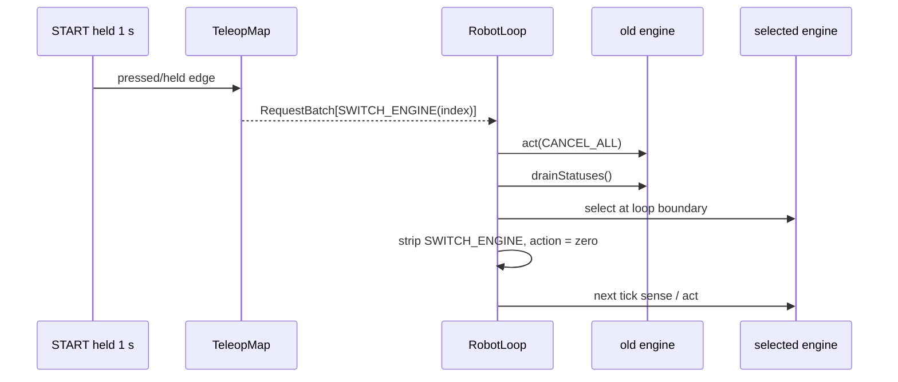

The factory orders index 0 = `direct`, index 1 = `cplx1`; switch statuses are
made by `RobotLoop` and are visible one tick later.

## Debug seams

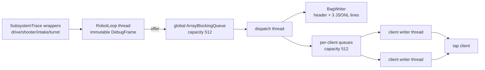

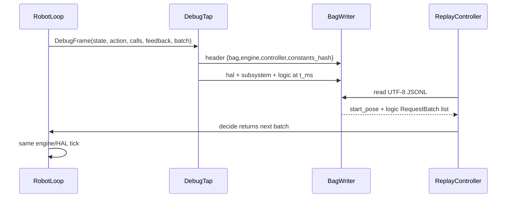

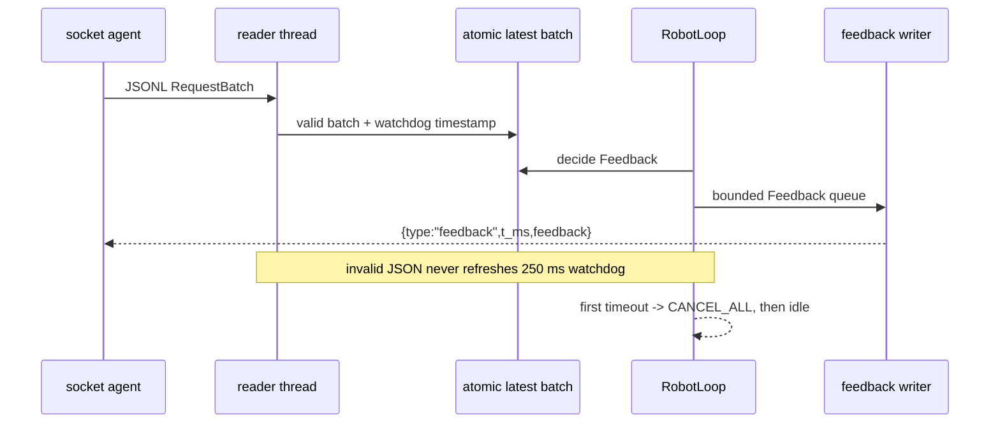
## Simulator

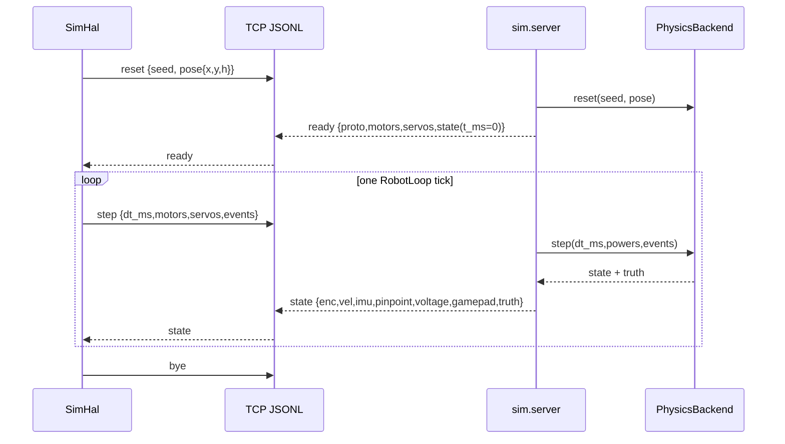

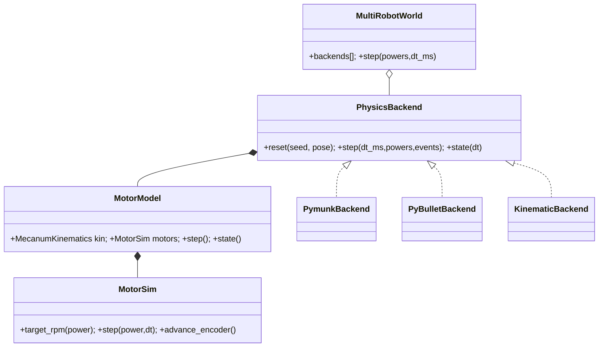

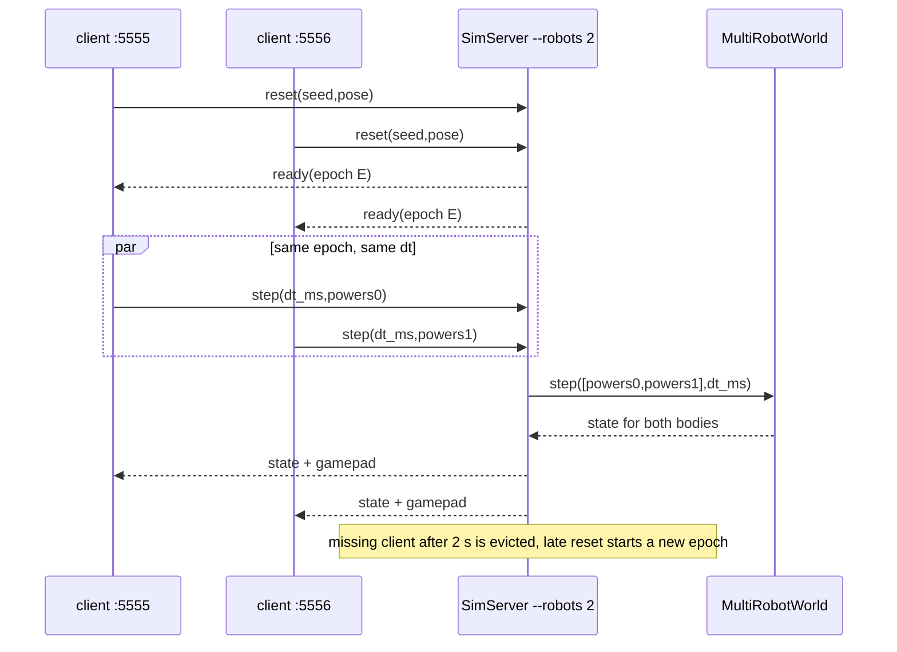

## Boundaries at a glance

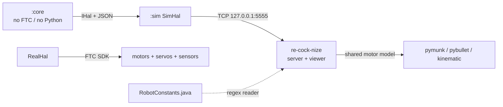

```mermaid
flowchart TB
    GP["GP1 left stick / right X"] --> Stream["RequestStream(vx,vy,omega,manualDrive)"]
    RB["RB press"] --> Shoot["Request.shoot(id,3)"]
    LB["LB edge"] --> Intake["INTAKE_ON / INTAKE_OFF"]
    Back["BACK press"] --> Reset["RESET_POSE(constants)"]
    Y["Y press"] --> Seq["AutoSequence: PATH → SHOOT(3)"]
    Start["START held 1 s"] --> Switch["SWITCH_ENGINE(0 or 1)"]
    Stream --> Batch["RequestBatch"]
    Shoot --> Batch
    Intake --> Batch
    Reset --> Batch
    Seq --> Batch
    Switch --> Batch
```

The poster intentionally leaves no policy in the HAL and no hardware knowledge in
controllers; records and arrows are the contract.
