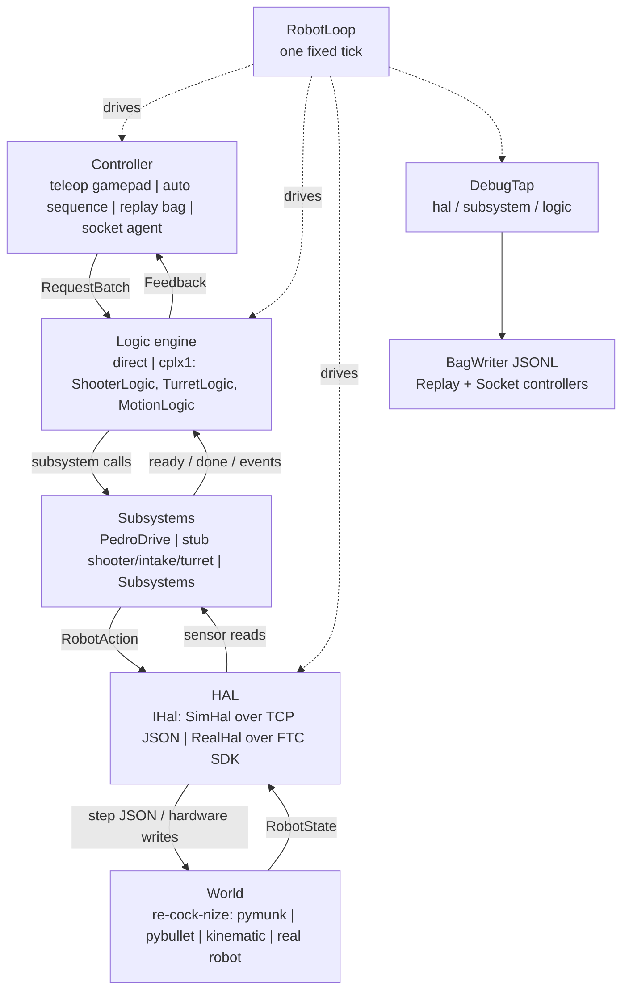
```{=latex}
\clearpage
```

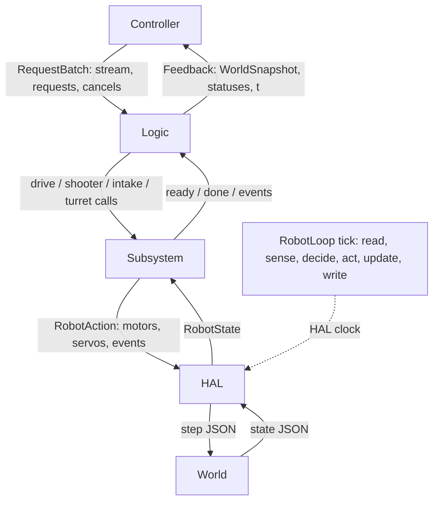
```{=latex}
\clearpage
```

# Variant B — Layer handbook

The handbook follows the runtime stack from the controller down to the world.
Solid arrows are calls or records; dotted arrows are orchestration rails.  Sources
are the current `robot-code` `dev-phase-1.1` head `dc4da66` and
`re-cock-nize` `dev-phase-1.1` head `518bf9c`.

## 1. Controller

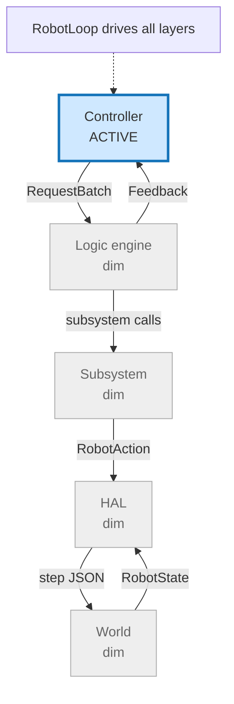

| Method | Arguments | Returns | Caller / consumer |
|---|---|---|---|
| `IController.decide` | `Feedback(world, statuses, t)` | `RequestBatch(stream, requests, cancels)` | `RobotLoop`; engine consumes the batch |
| `TeleopController.decide` | HAL `GamepadState`, prior `Feedback` | mapped batch, optionally merged with `SequenceRunner` | live teleop |
| `AutoController.decide` | `Feedback` | next immutable auto batch | FTC autonomous opmode |
| `ReplayController.decide` | ignored feedback | next logic batch from JSONL, then idle | bag replay |
| `SocketController.decide` | `Feedback` | latest valid batch; timeout emits `CANCEL_ALL` once | external agent |

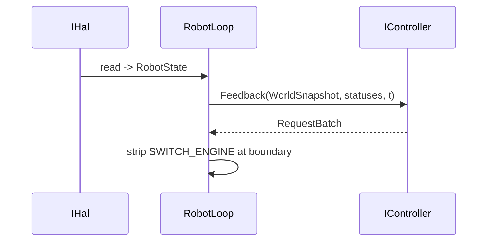

- `Buttons` is controller-only edge and hold state; it never references a device.
- `TeleopMap` maps sticks to `RequestStream`; RB emits `SHOOT(3)`, LB toggles intake.
- Y starts a short `AutoSequence`; BACK emits compile-time `RESET_POSE`.
- START held for one second emits one `SWITCH_ENGINE` request.
- Manual stick input cancels the sequence-owned IDs before returning the batch.
- Controllers must not import `IHal`, `PedroDrive`, physics, or FTC classes.

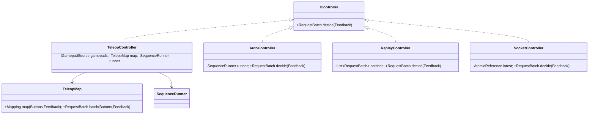
```{=latex}
\clearpage
```

## 2. Logic engine

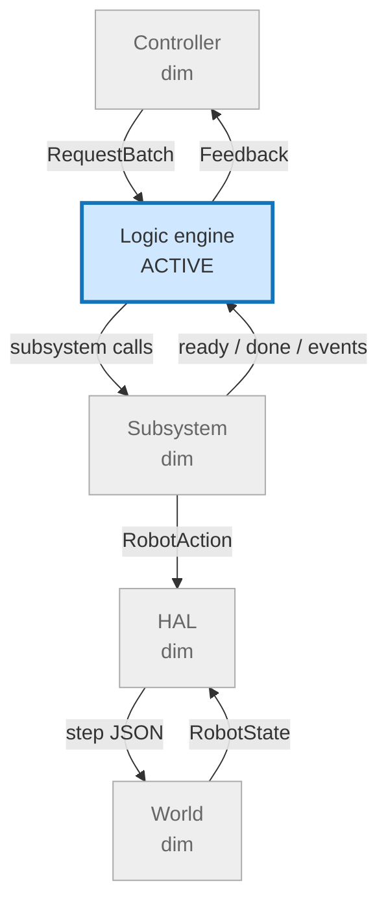

| Method | Arguments | Returns / side effect | Caller / consumer |
|---|---|---|---|
| `IRobotEngine.name` | none | `direct` or `cplx1` | `RobotFactory`, bags |
| `IRobotEngine.sense` | `RobotState` | `WorldSnapshot`; calls `Subsystems.observe` | `RobotLoop` |
| `IRobotEngine.act` | `RequestBatch` | updates jobs and subsystem commands | `RobotLoop` |
| `IRobotEngine.action` | none | latest `RobotAction` | `RobotLoop` → HAL |
| `IRobotEngine.drainStatuses` | none | statuses from preceding act | `RobotLoop` → controller next tick |
| `DirectEngine` | `Subsystems` + `DirectMap` | stream arbitration and edge jobs | `RobotFactory` |
| `CplxEngine1` | `Subsystems` + three logic modules | automatic aim, motion, shooter sequencing | `RobotFactory` |

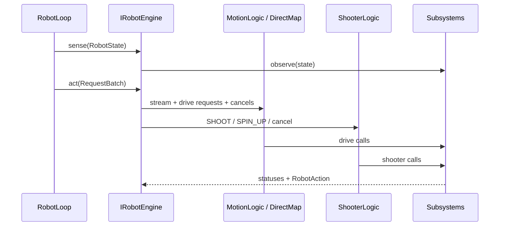

- `DirectEngine` owns one drive job and one shooter job; `DirectMap` rejects busy work.
- `CplxEngine1` owns `MotionLogic`, `TurretLogic`, `ShooterLogic`, and intake ownership.
- `MotionLogic` arbitrates manual stream against `GOTO`, `PATH`, and `TURN_TO`.
- `TurretLogic` aims automatically at the alliance goal and holds during feeding.
- `ShooterLogic.State` is `IDLE`, `SPINNING`, `FEEDING`, or `DONE`.
- Individual shooter cancel IDs are honored by cplx1; `CANCEL_ALL` is always honored.
- `RESET_POSE` reaches cplx1's handler through `MotionLogic`; `RobotLoop` owns switching.

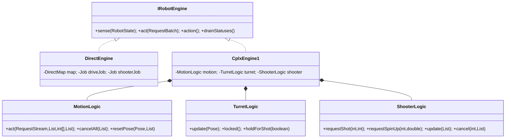
```{=latex}
\clearpage
```

## 3. Subsystem

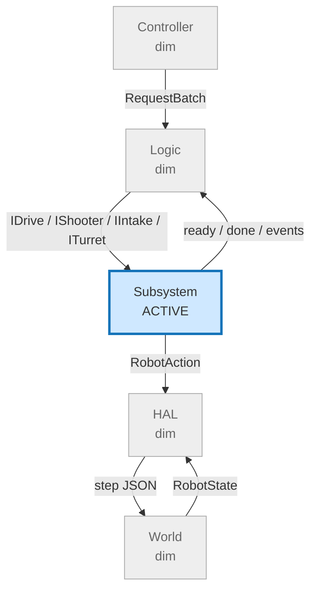

| Interface | Methods | Implementation(s) | Owner above the seam |
|---|---|---|---|
| `ISubsystem` | `observe(RobotState)`, `update(RobotAction.Builder)` | all mechanisms | `Subsystems` fixed order |
| `IDrive` | `manual`, `follow`, `turnTo`, `stop`, `resetPose`, `pathDone`, `pose` | `PedroDrive` | DirectMap / MotionLogic |
| `IShooter` | `spinUp`, `spinDown`, `isReady`, `feed`, `isFeeding` | `StubShooter` | DirectMap / ShooterLogic |
| `IIntake` | `run`, `stop`, `hasBall` | `StubIntake` | engines |
| `ITurret` | `aimAt`, `scan`, `hold`, `onTarget`, `angleRad` | `StubTurret` | DirectMap / TurretLogic |
| `Subsystems` | `observe`, `update` | record of four interfaces | both engines |

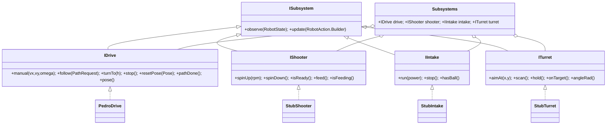

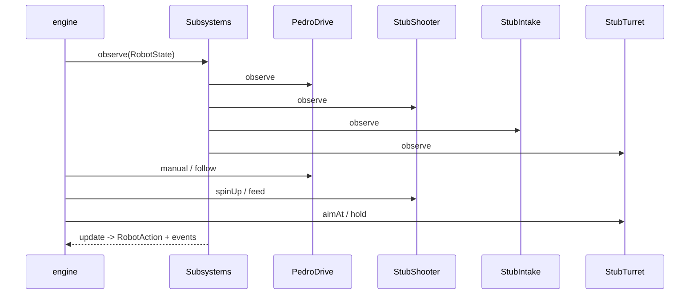

- Subsystems translate stable motor/servo physics into a narrow mechanism API.
- `PedroDrive` bridges `HalDrivetrain` and `HalLocalizer`; it is the only Pedro adapter.
- Stubs are timing/state machines, not physical shooter, intake, or turret models.
- `SubsystemTrace` can wrap all four and records calls for `DebugTap`.
- A subsystem must not inspect gamepad edges, request IDs, or JSON.
- `RobotAction` is assembled once per tick after every `observe` call.

```{=latex}
\clearpage
```

## 4. HAL

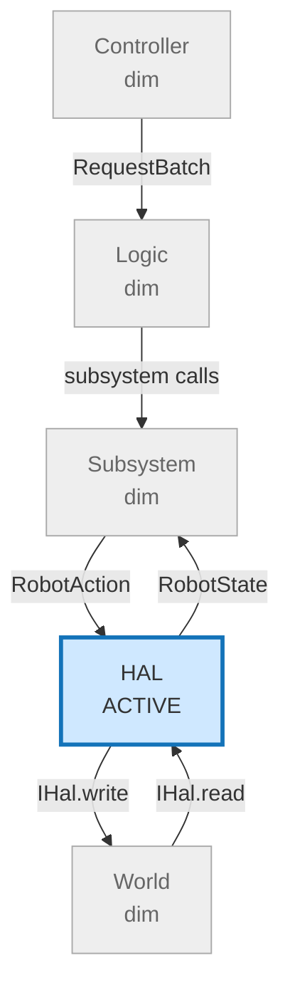

| Method | Arguments | Returns | Implementation |
|---|---|---|---|
| `IHal.now` | none | HAL-clock milliseconds | `RealHal`, `SimHal` |
| `IHal.read` | none | `RobotState` (enc, vel, yaw, Pinpoint, voltage) | same |
| `IHal.write` | `RobotAction` motor/servo maps and events | `void` | same |
| `IGamepadSource.get` | none | latest `GamepadState` | same |
| `SimHal` handshake | `seed`, `Pose` | `ready` plus state at `t_ms=0` | Java `:sim` ↔ Python server |

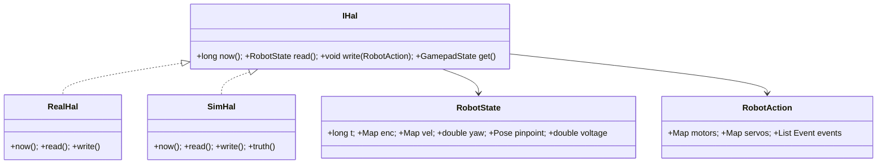

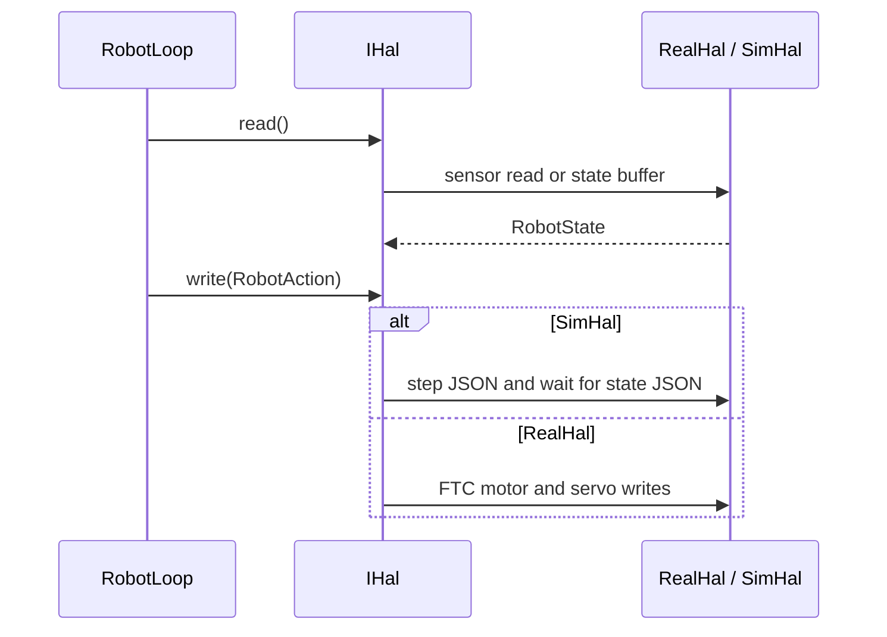

- HAL owns time, device I/O, gamepad sampling, and no policy.
- `RobotState.t` comes from HAL; `RobotState` never contains simulator truth.
- `RobotAction` keys are compile-time `RobotConstants` names; missing motor means zero.
- `SimHal` sends one line per step and blocks for its matching state.
- `RealHal` is in the FTC/Android module; `:core` has no SDK imports.
- `RobotConstants.java` is read by the Python simulator with a small regex parser.

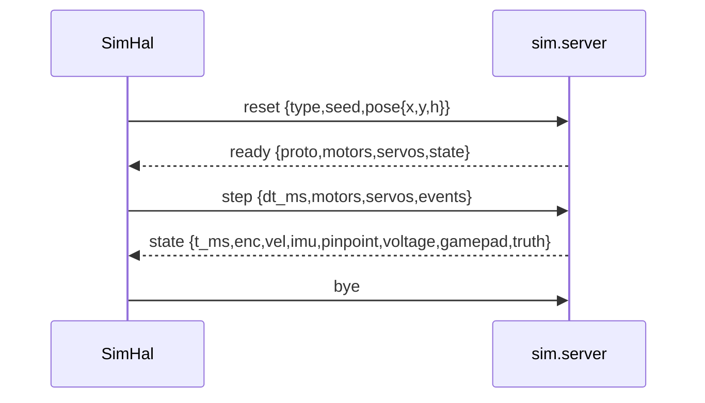
```{=latex}
\clearpage
```

## 5. World and simulator

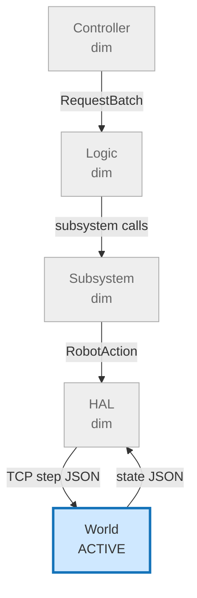

| Component | Owns | Current behavior |
|---|---|---|
| `sim.server` | TCP protocol, reset barrier, viewer | line-delimited JSON, protocol 1 |
| `PhysicsBackend` | body integration and contacts | `pymunk`, `pybullet`, or `kinematic` |
| `MotorModel` | shared motor lag, encoders, mecanum mapping, noise | first-order RPM and seeded sensors |
| `MultiRobotWorld` | one backend per robot, shared world where supported | lockstep `--robots N` |
| viewer | pygame field display and gamepad events | omitted by `--headless` |

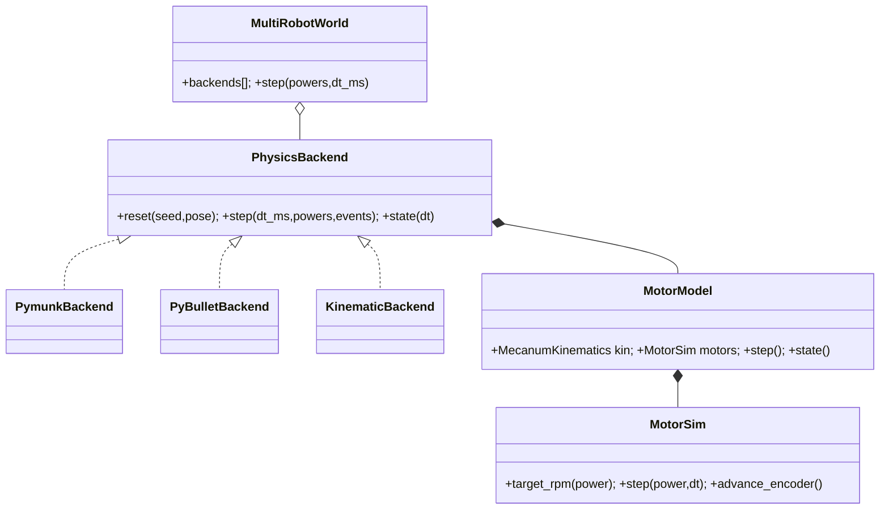

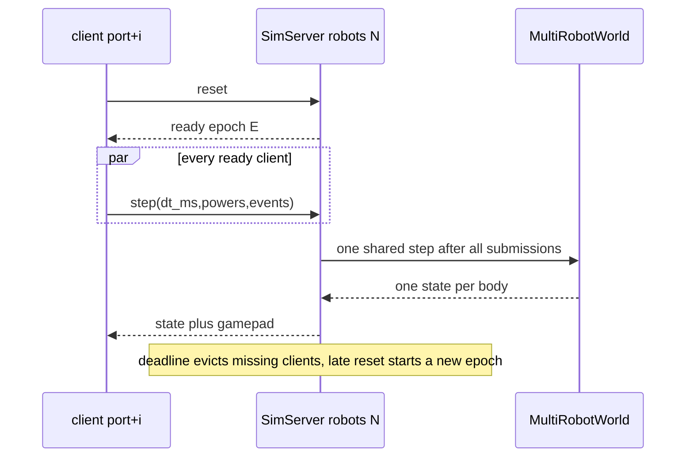

- Java owns `dt_ms`; simulation can run faster than wall time in headless mode.
- Pymunk and PyBullet share one world in multi-robot mode; kinematic bodies step independently.
- `truth` is for tests/viewer only and is never copied into `RobotState`.
- Python reads motor, wheel, battery, Pinpoint, and stub timing constants from Java.
- Servo commands are validated but non-empty servo physics is intentionally unsupported.
- Deterministic reset seed and ordered lockstep submissions are part of protocol version 1.

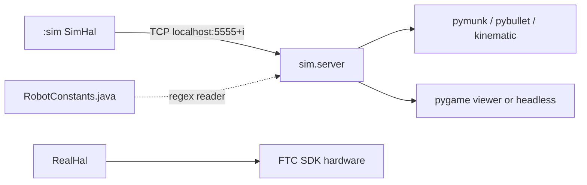
```{=latex}
\clearpage
```

## 6. Cross-layer records and seams

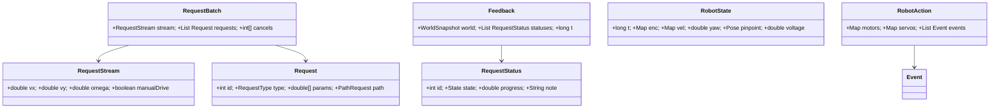

```mermaid
flowchart LR
    Frame["DebugFrame<br/>state + action + calls + feedback + batch"] --> Tap["DebugTap"]
    Tap --> Hal["hal JSONL"]
    Tap --> Sub["subsystem JSONL"]
    Tap --> Logic["logic JSONL"]
    Hal --> Bag["BagWriter .jsonl"]
    Sub --> Bag
    Logic --> Bag
    Bag --> Replay["ReplayController"]
```

- Records copy their collections; only the owning layer mutates its private jobs.
- `RequestStatus` terminals are `DONE`, `FAILED`, and `REJECTED`; feedback lags one tick.
- `DebugTap` receives immutable frames through a bounded global queue (capacity 512).
- The dispatcher writes the bag before offering each seam line to bounded clients.
- Socket and replay controllers sit above the same `IController` seam as teleop and auto.

```mermaid
stateDiagram-v2
    [*] --> ACTIVE
    ACTIVE --> DONE: subsystem complete
    ACTIVE --> ACTIVE: progress
    ACTIVE --> REJECTED: cancel or validation
    ACTIVE --> FAILED: engine failure
    DONE --> [*]
    REJECTED --> [*]
    FAILED --> [*]
```
