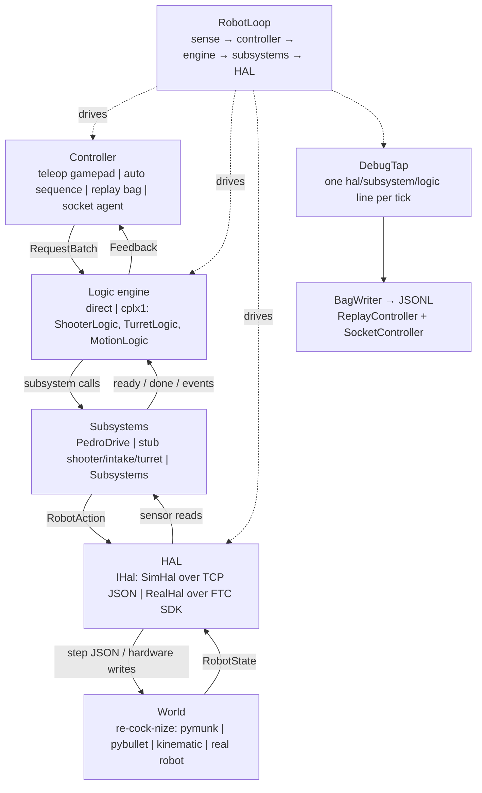
```{=latex}
\clearpage
```

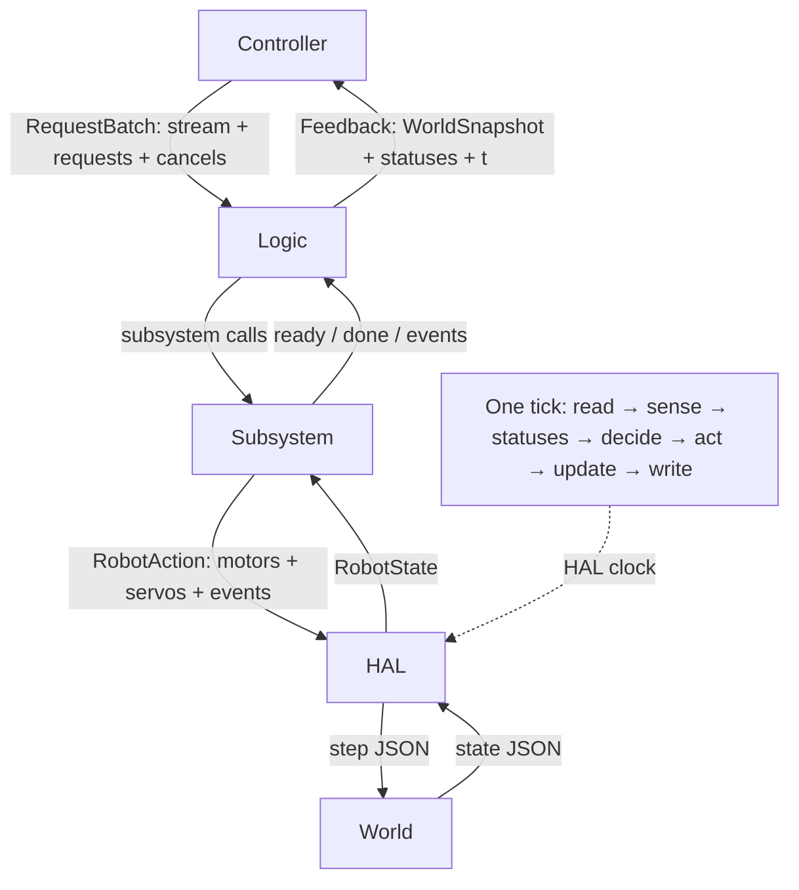
```{=latex}
\clearpage
```

# Variant C — Follow one request

The examples use the current `robot-code` `dev-phase-1.1` head `dc4da66` and
`re-cock-nize` `dev-phase-1.1` head `518bf9c`.  IDs are illustrative values from
the real allocators (teleop starts at 10000; `SequenceRunner` starts at 1).

## 1. `SHOOT(3)` from RB to DONE

### 1.1 Press, batch, and sense

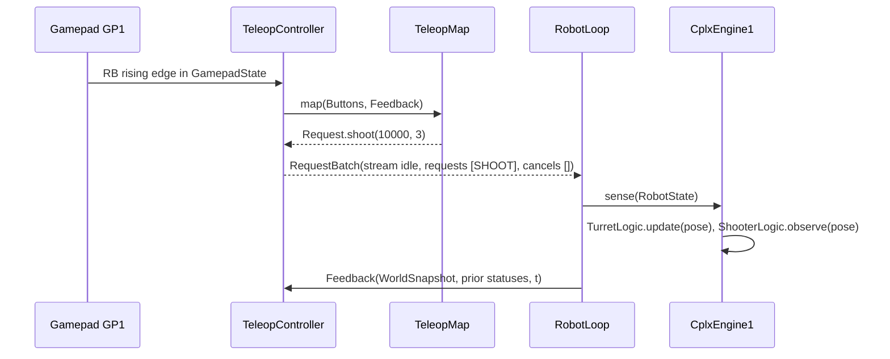

At this edge the exact Java record is
`Request(10000, SHOOT, double[]{3.0}, null)` inside
`RequestBatch(RequestStream.idle(), [request], new int[0])`.

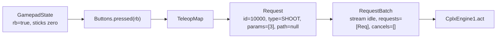

### 1.2 Spin, aim, and feed

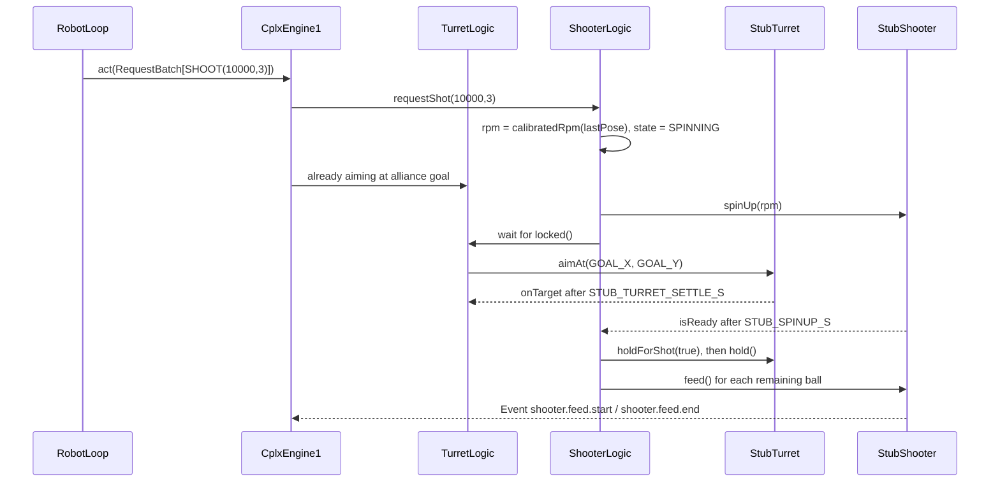

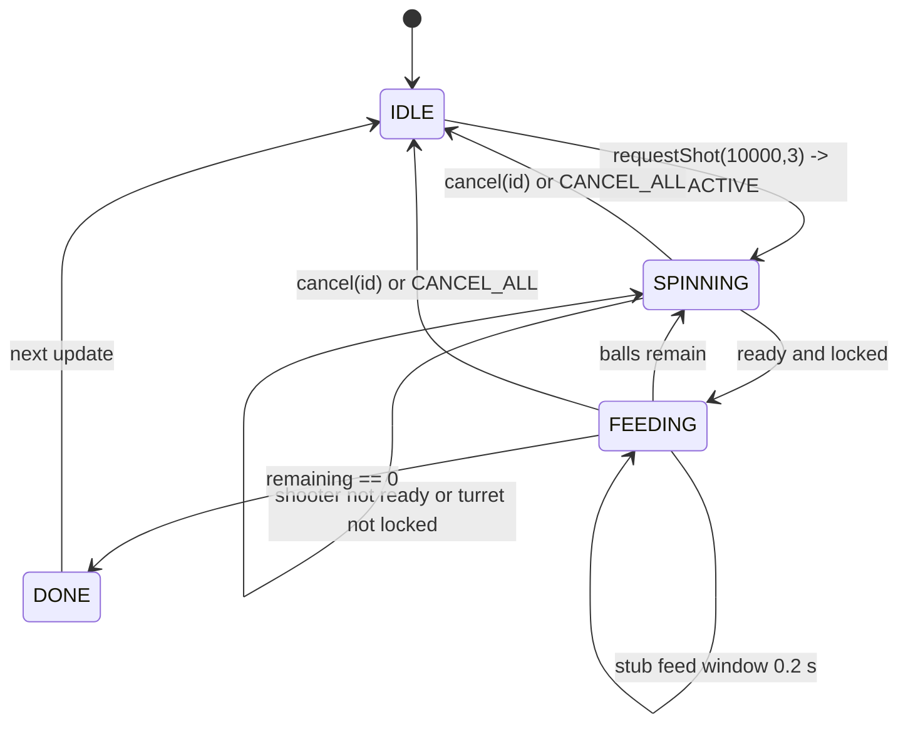

The current stub has no physical feeder/servo model.  Its downward record is
`RobotAction(motors={}, servos={}, events=[Event("shooter.feed.start", t, {})])`
then a matching `shooter.feed.end`; a future real subsystem would own any servo pulse.

### 1.3 Action, HAL, and completion feedback

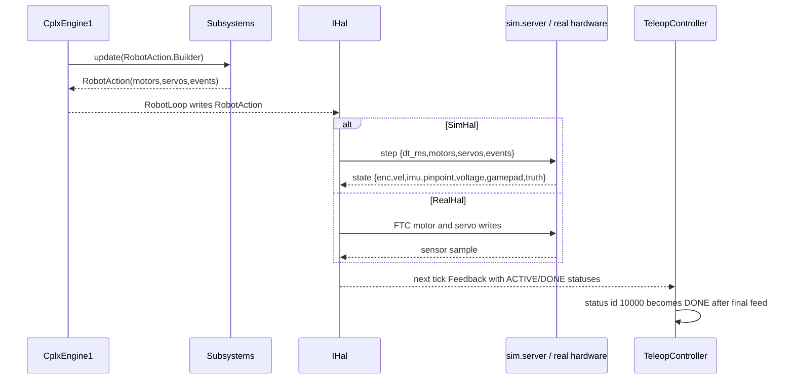

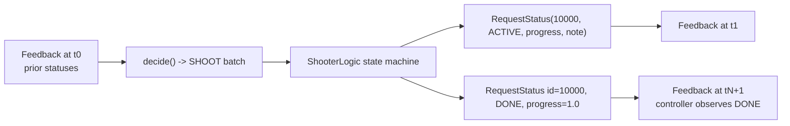
```{=latex}
\clearpage
```

## 2. `GOTO(path)` / `PATH` from auto to drive completion

### 2.1 Auto builder emits the path record

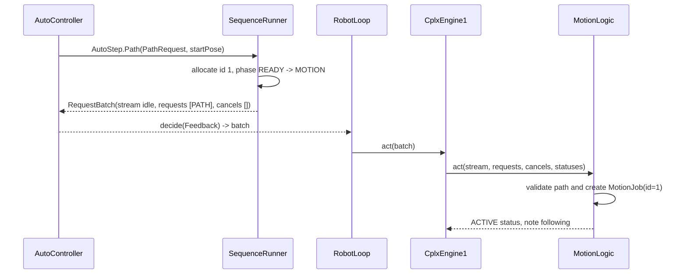

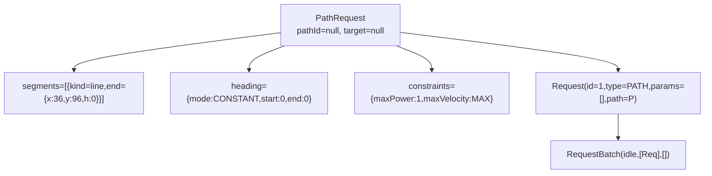

The canonical logic-seam JSON uses these exact keys (from `SeamJson.path`):

```json
{"seam":"logic","t_ms":1000,"batch":{"stream":{"vx":0.0,"vy":0.0,"omega":0.0,"manualDrive":false},"requests":[{"id":1,"type":"PATH","params":[],"path":{"pathId":null,"target":null,"constraints":{"maxPower":1.0,"maxVelocity":1.7976931348623157E308},"segments":[{"kind":"line","end":{"x":36.0,"y":96.0,"h":0.0}}],"heading":{"mode":"CONSTANT","start":0.0,"end":0.0},"holdEnd":true,"velocityConstraint":null,"braking":null}}],"cancels":[]}}
```

### 2.2 Pedro, action, and DONE

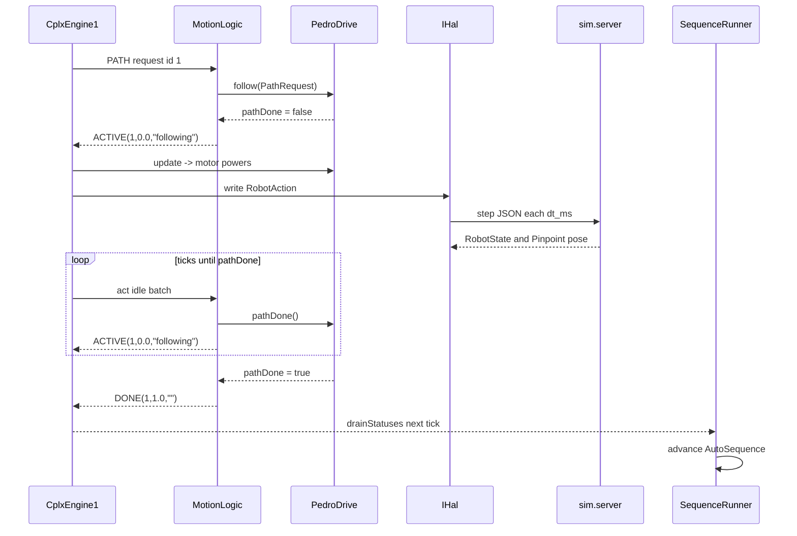

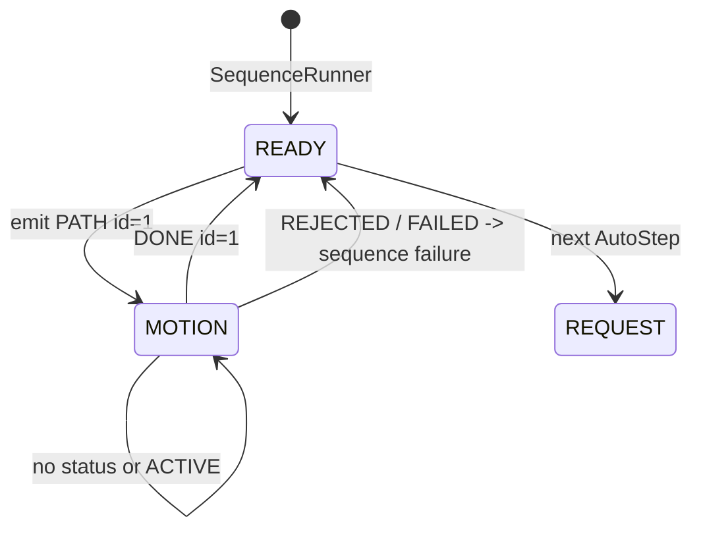

`GOTO` is the three-number request form (`[x,y,headingRad]`) consumed by the
same `MotionLogic.start` path; an auto builder normally emits `PATH` with a
`PathRequest` instead.  A busy drive or malformed path is `REJECTED`, never guessed.
```{=latex}
\clearpage
```

## 3. `SWITCH_ENGINE` at a loop boundary

### 3.1 START gesture to selection

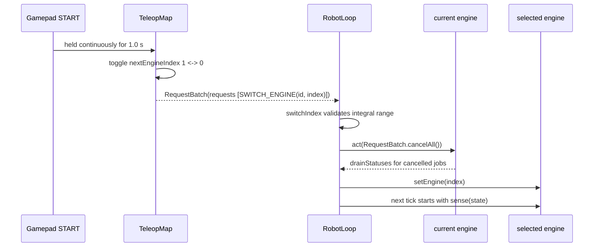

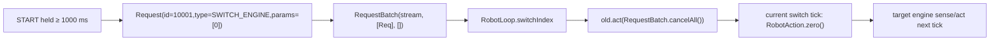

### 3.2 Exact handoff records and feedback

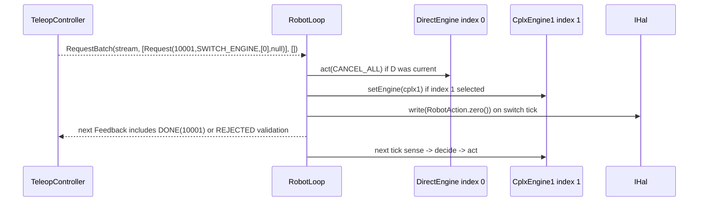

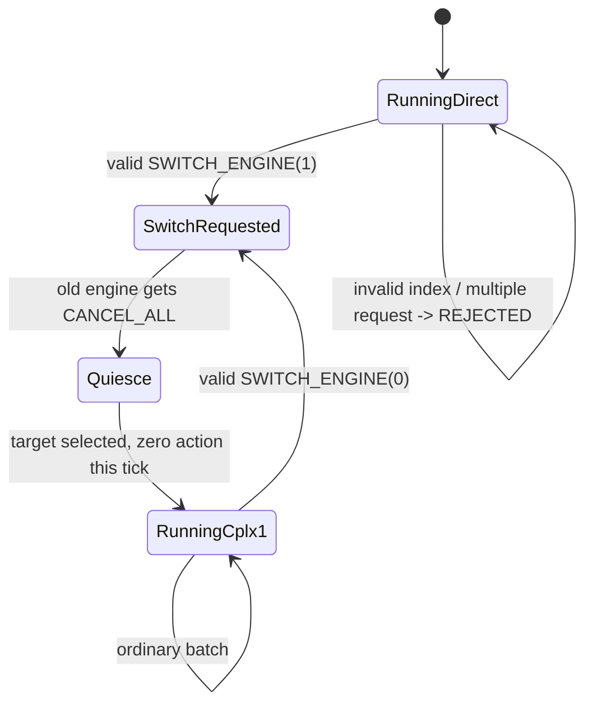

The factory order is index `0 = direct`, `1 = cplx1`.  `SWITCH_ENGINE` never
reaches `DirectMap` or a cplx module; `RobotLoop` strips it, and statuses are
visible upward one tick later.
```{=latex}
\clearpage
```

## 4. The same seams in JSONL

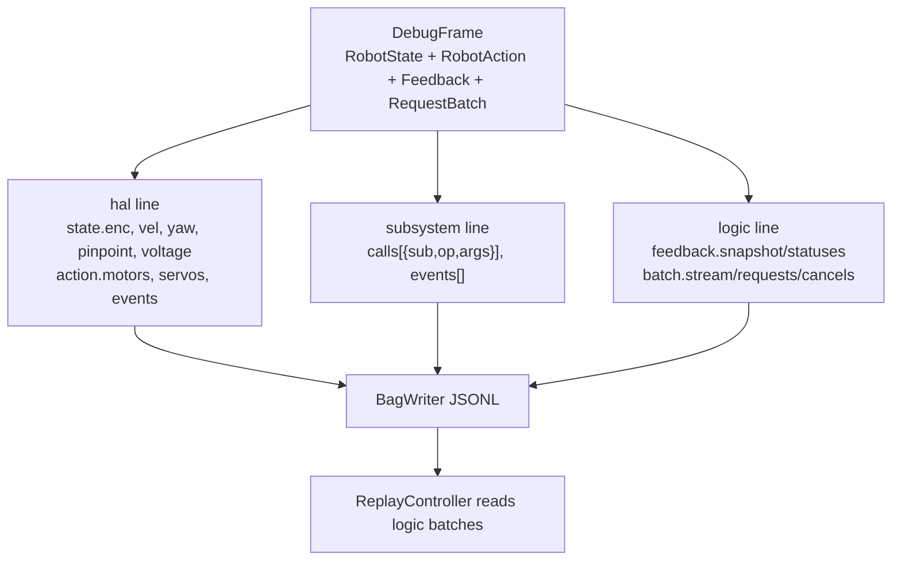

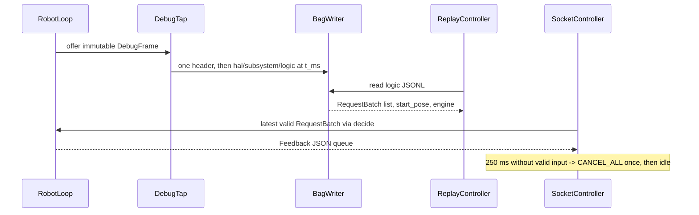

`RobotState` never carries simulator `truth`; it is retained only by `SimHal`
for tests/viewer.  The record path is the same on the real robot and simulator;
only `IHal` changes.
