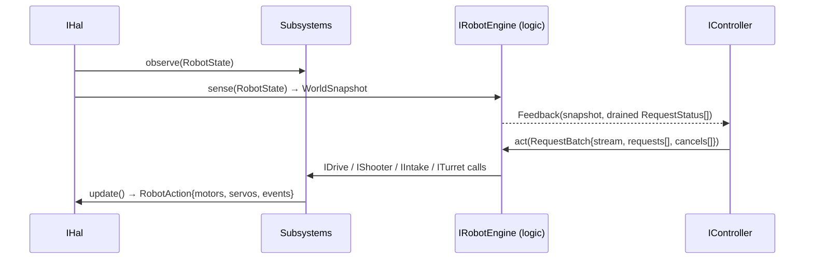
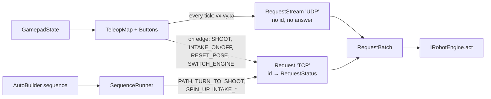
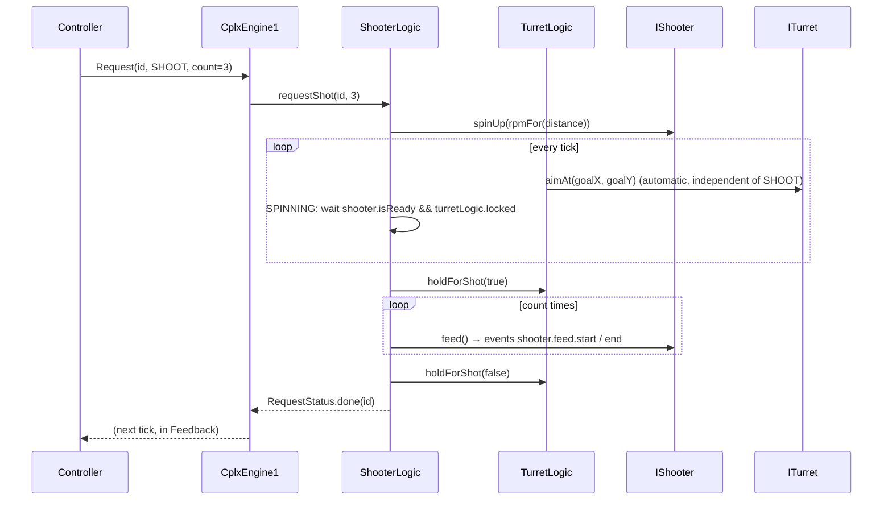
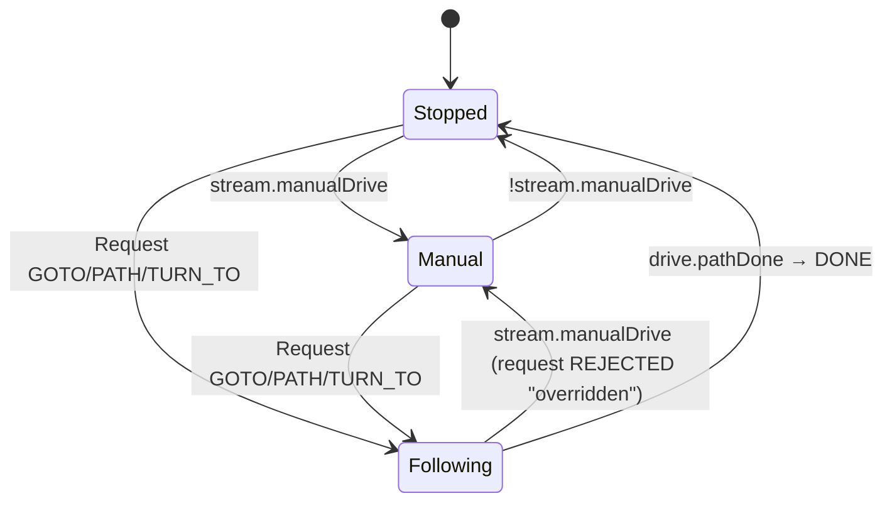
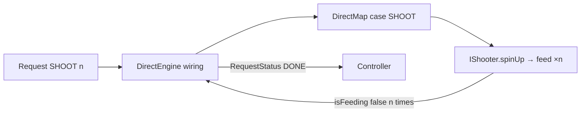
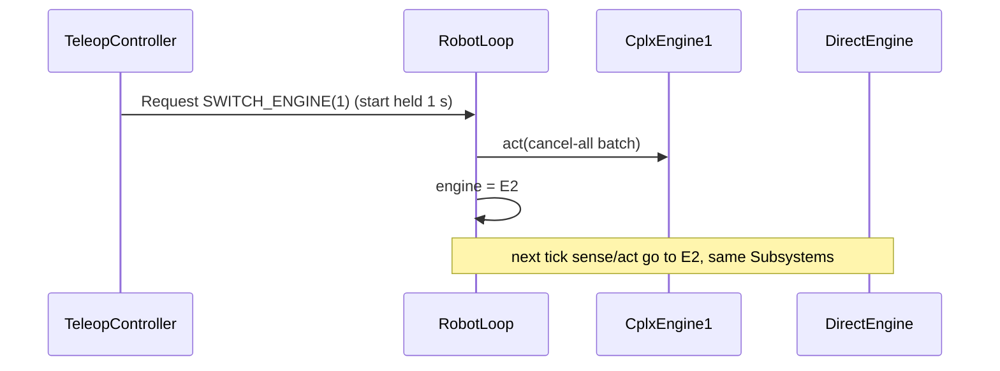

# Request flow (Phase 1.1 R3 design)

How a request travels through the layers, who touches it, and what it triggers.
Mermaid; render in any Markdown viewer with Mermaid support.

## 1. One tick

## 2. Two message kinds, controller → logic

## 3. SHOOT request inside cplx1

## 4. Drive arbitration in MotionLogic

## 5. Same SHOOT in the direct engine (no logic)

## 6. Engine switch (contingency)

